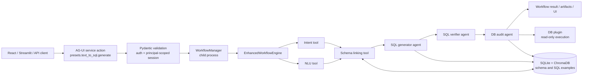
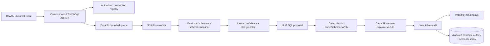

# Аудит архитектуры и кода Text-to-SQL с нуля

**Дата:** 2026-07-10
**Версия кода:** `ba201b90fe988afd9a93eb9a5a73cc37619ae3b3`
**Статус:** завершённый независимый аудит; спецификация подтверждена пользователем
**Изменения кода:** не выполняются; этот файл — единственный изменяемый артефакт аудита

## Правила и границы аудита

- Анализ выполняется с нуля по текущему коду, конфигурации, тестам и исполняемым проверкам на `HEAD`.
- Предыдущие аудиты и remediation-планы не используются как источник проблем, приоритетов или оценки.
- В реестр попадают только находки с уверенностью не ниже `MEDIUM`, прошедшие adversarial-проверку.
- Для каждой находки будут указаны: доказательство `file:line`, нарушенный контракт, механизм, влияние, challenge verdict, severity/confidence и рекомендация.
- Сам код в рамках этой задачи не исправляется.

## Область проверки

1. AG-UI/FastAPI entrypoint, authentication, authorization, ownership и request validation.
2. `WorkflowManager`, дочерний процесс, Enhanced Workflow Engine, DAG, условия, retries, checkpoints, cancel/result.
3. NLU и intent extraction.
4. Загрузка/интроспекция схемы, schema linking, фильтрация схемы, выбор главной таблицы, JOIN graph/containment и value grounding.
5. RAG SQL-примеров и схемная память: SQLite, ChromaDB, индексация, retrieval, cache, rebuild и конкурентный доступ.
6. Генерация и post-processing SQL, диалекты, schema-aware validation.
7. Safety gate, EXPLAIN, DB plugins, resource limits, dry-run и audit logging.
8. AgentFactory, профили SQL-агентов, tool loading и runtime metadata/DSN propagation.
9. React и Streamlit UI, история, схема, статус, артефакты и представление ошибок.
10. Конфигурационные профили, observability, eval/gold set, unit/integration/e2e coverage и deployment surface.

## Восстановленная текущая архитектура

### Два orchestration-пути

- Целевой Text-to-SQL путь — детерминированный `text_to_sql_pipeline.yaml` через service action. YAML помечен `requires_enhanced_engine: true`; generic `workflows.start` и forwarded workflow path не должны запускать этот entrypoint.
- Параллельно существует emergent-путь `DynamicAgentSystem` с manager и динамически созданной командой. Он входит в область анализа как связанный код и потенциальная альтернативная точка входа, но не считается целевым production-контрактом Text-to-SQL без отдельного подтверждения.

## Подтверждённая целевая спецификация

### S1. Вход и владение

- Вход: непустой NL-запрос, явный доступный текущему principal DSN/connection reference, `max_rows` в диапазоне 1..10000 и только `safety_level=strict`.
- Аутентификация по умолчанию обязательна; запуск, DB config, session/run state и память другого principal недоступны обычному пользователю.
- `run_id` генерирует сервер для каждого запуска; стабильный `session_id` выводится из DSN либо принимается явно и затем scope-ится по principal.
- DSN и секреты не должны попадать в prompt, ответ, события, логи, telemetry или пользовательскую историю в открытом виде.

### S2. Оркестрация

- NLU и intent extraction могут выполняться параллельно; schema linking ждёт оба результата.
- Последовательность `schema linking -> SQL generation -> verification -> execution/audit` задаёт DAG, а не LLM.
- Text-to-SQL обязан выполняться Enhanced Engine; legacy fallback по умолчанию запрещён.
- Ошибка шага, не покрытая разрешённым bounded retry, завершает workflow явно; cancellation завершает дочерний процесс и оставляет согласованный terminal result.

### S3. Schema linking и качество

- Schema linking получает canonical `metrics/dimensions/filters`, загружает актуальную схему из явного контекста, schema/RAG storage либо DB introspection и возвращает только реально разрешённые таблицы/колонки.
- Все требуемые таблицы должны быть связаны валидным JOIN-путём; single-table запрос считается связным без JOIN.
- Неоднозначность, отсутствие схемы, недостижимые таблицы либо низкая уверенность приводят к явному abstain/skip, а не к генерации по выдуманной схеме.
- Value grounding, heuristic fallback, graph/containment и иные деградации разрешены только явно и должны быть наблюдаемы.

### S4. Генерация, верификация и исправление

- Генератор создаёт минимальный dialect-aware read-only SQL по исходному вопросу и неизменённому schema-linking context; результат имеет обязательные поля `sql` и `description`.
- Форматирование, quoting и schema-aware validation не должны менять семантику или silently пропускать невалидный SQL.
- Verifier использует статический safety check и `EXPLAIN`, возвращает структурный `Approved|Rejected`; rejection может вызвать не более двух повторов генерации с feedback.
- Ошибка исполнения либо структурно подозрительный результат может вызвать один bounded цикл `generation -> verification -> execution` с execution feedback.

### S5. Runtime safety

- Реальное исполнение допускает только разрешённые read-only statement kinds и повторно проходит детерминированный fail-closed safety gate независимо от LLM-verdict.
- `dry_run_only=true` запрещает исполнение сгенерированного SQL. Подготовительные
  read-only обращения к БД, включая schema introspection, допускаются.
- `max_rows` применяется на SQL- и fetch-уровне; DB-level statement timeout используется там, где поддерживается плагином.
- Операция исполнения аудитируется; в RAG сохраняется только действительно успешный SQL.

### S6. Память и RAG

- Схема и SQL-примеры namespace-ятся согласованно с DSN/session/principal и не смешиваются между БД или пользователями.
- SQLite является durable metadata store, ChromaDB — semantic index; частичный сбой одной стороны не должен выглядеть полным успехом и должен быть восстановим rebuild-операцией.
- Индексация, cache invalidation, retrieval и rebuild должны оставаться корректными при конкурентных потоках и процессах.
- Отсутствие embeddings/RAG данных отличается от ошибки backend и не должно незаметно менять семантику production-пути.

### S7. Выход, UI и наблюдаемость

- Пользователь получает terminal status, фактически сгенерированный SQL, execution/dry-run status, данные либо явную причину abstain/failure; UI не реконструирует успех из косвенных признаков.
- React и Streamlit используют один service contract и одинаково трактуют параметры, статусы и result/artifacts.
- История и telemetry не являются источником истины выполнения; они строятся из server-owned результата и не содержат секретов или raw DSN.
- Production quality подтверждается не только unit-тестами, но и репрезентативным reviewed gold set с execution accuracy, schema-linking precision/recall, dialect/profile slices, latency/error/abstention metrics.

## Production-премисы оценки

В итоговой оценке разделены два уровня:

1. **Безопасная техническая эксплуатация** — корректность, изоляция, fail-closed execution, concurrency, восстановление и observability.
2. **Качество решения бизнес-задачи Text-to-SQL** — execution accuracy, schema-linking quality, ambiguity handling и проверка на реальных схемах/вопросах.

Использован консервативный production envelope: multi-user deployment, несколько одновременных запусков, схемы от десятков до сотен таблиц, все заявленные плагины (`sqlite`, `postgres`, `duckdb`, `mysql`, `sapiq`, `impala`) и недоверенный пользовательский NL-ввод.

## Реестр подтверждённых проблем

### Сводка

Обнаружено 33 подтверждённые проблемы: 24 `HIGH`, 9 `MEDIUM`.
Severity отражает описанный выше multi-user production envelope, а не удобство
исправления. Все находки имеют confidence не ниже `MEDIUM`; формулировки,
которые не выдержали независимый challenge, вынесены в отдельный раздел и не
участвуют в оценке.

| ID | Severity | Кратко | Нарушает |
|---|---|---|---|
| F-01 | HIGH | обязательные runtime postconditions существуют только в prompt | S2, S5, S7 |
| F-02 | HIGH | API-параметр `strict` не включает strict safety profile | S5 |
| F-03 | HIGH | обычный user может стартовать run, но не может читать/отменять его | S1, S7 |
| F-04 | HIGH | AG-UI run и дочерний workflow имеют раздельные ownership/lifecycle | S1, S2, S7 |
| F-05 | HIGH | React UI не умеет аутентифицироваться при secure-by-default backend | S1, S7 |
| F-06 | HIGH | лимит AG-UI runs обходится неограниченными дочерними процессами | S2, S5 |
| F-07 | HIGH | Enhanced Engine игнорирует step timeout и global duration | S2, S5 |
| F-08 | HIGH | sidecar checkpoint secrets теряет записи конкурентных runs | S1, S2, S6 |
| F-09 | HIGH | неоднозначный/частичный linking по умолчанию не abstain-ится | S3 |
| F-10 | HIGH | публичный режим без schema suggestions запускает генерацию с пустой схемой | S3, S4 |
| F-11 | HIGH | corrective retries повторяют тот же prompt, execution retry не разрешает feedback | S4 |
| F-12 | HIGH | distinct/value-grounding queries обходят runtime safety contract | S5 |
| F-13 | HIGH | schema index пишется в principal scope, а semantic read ищет без scope | S1, S3, S6 |
| F-14 | HIGH | schema namespace не учитывает DB role и не проверяет live staleness | S1, S3, S6 |
| F-15 | HIGH | successful-SQL learning loop физически не соединён с генератором | S4, S6 |
| F-16 | HIGH | composite FK превращается в JOIN по одному столбцу | S3, S4 |
| F-17 | HIGH | SQLite/Chroma partial failure может выглядеть успешной индексацией | S3, S6 |
| F-18 | MEDIUM | rebuild пропуски/ошибки всё равно маркирует как ready/success | S6, S7 |
| F-19 | HIGH | Streamlit path не изолирует пользователей, DSN и историю | S1, S7 |
| F-20 | HIGH | HTML-отчёт сохраняет активный HTML и открывается с script-capable sandbox | S1, S7 |
| F-21 | HIGH | statement timeout фактически отсутствует у 5 из 6 плагинов | S5 |
| F-22 | HIGH | SAP IQ/Impala требуют read-only fail-open и не упакованы зависимостями | S5, S7 |
| F-23 | HIGH | user-supplied raw DSN разрешает произвольный network/file target | S1, S5 |
| F-24 | MEDIUM | wide tables режутся по первым 20 колонкам до LLM linking | S3 |
| F-25 | MEDIUM | generic `/agent` оставляет второй, неэквивалентный Text-to-SQL path | S2, S5, S7 |
| F-26 | MEDIUM | AgentFactory eager-load-ит весь tool/MCP/memory ecosystem | S2, S7 |
| F-27 | HIGH | quality evidence — один oracle-assisted SQLite case | S7 |
| F-28 | HIGH | production deployment и dependency reproducibility отсутствуют | S2, S7 |
| F-29 | MEDIUM | retention/history/logging policy не исполняется автоматически | S1, S6, S7 |
| F-30 | MEDIUM | workflow fork создаётся из threaded server с унаследованными locks | S2, S6 |
| F-31 | MEDIUM | token map без subject превращает bearer token в durable owner id | S1 |
| F-32 | MEDIUM | YAML runtime cache не инвалидируется при изменении файла | S5, S7 |
| F-33 | MEDIUM | contract test не запускается из-за устаревшего test double | S7 |

### F-01. Mandatory runtime gate и terminal success не являются инвариантами кода

- **Evidence:** execution/audit/save реализованы как инструкции LLM-agent
  (`agent_profiles/db_audit_agent.yaml:52-75`). Метаданные
  `required_runtime_gate` есть только в YAML
  (`workflow_pipelines/text_to_sql_pipeline.yaml:285-355`) и не имеют
  Python-enforcer. AgentFactory не валидирует вызванные tools/postconditions и
  прямо не сохраняет tool calls в step result
  (`agent_factory.py:413-449`).
- **Evidence terminal state:** rejected verifier приводит к `SKIPPED`
  DB-audit, но Enhanced Engine завершает run при отсутствии `FAILED`
  (`workflow/enhanced_engine.py:332-376,438-488`). WorkflowManager считает
  успехом `completed` без failed steps
  (`workflow/streamlit_api.py:1116-1159`). Обе UI затем сохраняют такой run
  как success (`frontend/client/src/app/components/sections/TextToSqlSection.tsx:351-395`,
  `streamlit_app/pages/05_Text_to_SQL.py:1179-1210`).
- **Механизм:** LLM может не вызвать executor, audit или save; tool может
  вернуть failure как observation; verifier может reject. Во всех случаях
  orchestration всё ещё способна сообщить `completed/success`.
- **Влияние:** ложный успех, отсутствие обязательного аудита, несогласованный
  UI и невозможность доказать, что выданные данные прошли runtime policy.
- **Challenge:** **CONFIRMED**. Сам `secure_db_executor` повторно проверяет SQL,
  но код не гарантирует, что agent его вызвал и что остальные postconditions
  выполнены.
- **Исправление:** вынести execution, audit и validated save в typed
  deterministic steps; success вычислять по явному state machine, включая
  `approved`, `executed|dry_run` и `audited`.

### F-02. `safety_level=strict` не включает strict ruleset

- **Evidence:** request принимает только поддерживаемый `safety_level`
  (`backend/fastapi_app/agui/_t2s_requests.py:67-75,125-133`), а child process
  выставляет `TEXT_TO_SQL_SAFETY_LEVEL`
  (`workflow/streamlit_api.py:453-515`). Loader выбирает профиль из другой
  переменной — `TEXT_TO_SQL_SAFETY_PROFILE`/`TEXT2SQL_PROFILE` — и иначе
  берёт `default`
  (`custom_tools/text_to_sql/validators/safety_config.py:9-16,34-36,138-148`).
  Расширенные forbidden functions находятся именно в strict profile
  (`config/text_to_sql/safety.yaml:39-71,99-215`).
- **Динамическое подтверждение:** при единственной переменной
  `TEXT_TO_SQL_SAFETY_LEVEL=strict` loader вернул `profile=default`,
  `forbidden_functions=0`, `max_query_length=10000`; статический check
  допустил вызов `pg_sleep`.
- **Влияние:** публично заявленный strict режим исполняется с default ruleset.
- **Challenge:** **CONFIRMED**; это две независимые оси конфигурации без
  связывающего кода, а не только неудачное имя.
- **Исправление:** один typed `SafetyPolicy`, построенный из request и
  переданный по DI; запретить process-global env как runtime request channel.

### F-03. User authorization contract делает результат недоступным владельцу

- **Evidence:** user allowlist содержит `presets.text_to_sql.generate`, но не
  status/result/artifacts/cancel/history/schema
  (`backend/fastapi_app/agui/service.py:120-234`); classifier относит эти
  действия к admin (`backend/fastapi_app/agui/service.py:253-267`). React
  после старта именно их опрашивает
  (`frontend/client/src/app/components/sections/TextToSqlSection.tsx:198-215,319-418`).
  Preset возвращает лишь child `run_id`
  (`backend/fastapi_app/agui/service.py:4288-4341`).
- **Влияние:** обычный authenticated user может создать дорогой DB workflow, но
  не может получить SQL/result и отменить его; рабочий UI требует admin token.
- **Challenge:** **CONFIRMED** тестами policy. Это не defence-in-depth, потому
  что owner check уже существует для AG-UI run, а необходимые owner-scoped
  операции полностью запрещены ролью.
- **Исправление:** owner-scoped job API: user имеет status/result/cancel своих
  runs, admin — cross-owner operations; проверка tenant+subject на каждом
  endpoint.

### F-04. Outer AG-UI run и child workflow не связаны ownership/lifecycle

- **Evidence:** RunManager создаёт principal-owned outer run
  (`backend/fastapi_app/agui/run_manager.py:122-153`), service action стартует
  отдельный WorkflowManager process
  (`backend/fastapi_app/agui/service.py:4299-4331`), после чего runner
  немедленно завершает outer action
  (`backend/fastapi_app/agui/runner.py:616-681`). В process args и active
  record нет principal/tenant
  (`workflow/streamlit_api.py:759-880`). Cancel RunManager работает только с
  outer task (`backend/fastapi_app/agui/run_manager.py:156-200,275-290`).
- **Влияние:** terminal state outer run ничего не говорит о child; cancel
  outer run не гарантирует cancel DB workflow; child нельзя безопасно открыть
  владельцу без новой ownership model.
- **Challenge:** **CONFIRMED**. Generic full-workflow path умеет ожидать/cancel,
  но Text-to-SQL принудительно маршрутизирован как service action
  (`backend/fastapi_app/agui/runner.py:280-299`).
- **Исправление:** один durable `TextToSqlRun` с owner, состоянием, PID/job id,
  cancel token и terminal reason; не создавать второй несвязанный run.

### F-05. React UI несовместим с обязательной аутентификацией backend

- **Evidence:** backend по умолчанию требует bearer/X token
  (`backend/fastapi_app/agui/auth.py:94-128,156-165`). UI создаёт
  `HttpConnectAgent` только с URL
  (`frontend/client/src/app/page.tsx:119-123,1791-1805`); в frontend нет
  token/login flow.
- **Влияние:** secure default не работает из браузера. Реальное развёртывание
  вынуждено выключить auth или инжектировать общий token reverse proxy, что
  уничтожает per-principal ownership.
- **Challenge:** **CONFIRMED**. Внешний SSO proxy мог бы исправить ситуацию, но
  его contract/configuration в репозитории отсутствует.
- **Исправление:** документированный OIDC/session flow или short-lived backend
  token; frontend должен передавать identity без хранения DB credentials.

### F-06. Child process concurrency не ограничен

- **Evidence:** AG-UI concurrency cap применяется к outer runs
  (`backend/fastapi_app/agui/run_manager.py:41-54,122-142`), а outer run
  завершается сразу после spawn (F-04). WorkflowManager на каждый запрос
  без semaphore/queue создаёт `multiprocessing.Process`
  (`workflow/streamlit_api.py:852-880`).
- **Влияние:** последовательные start-вызовы обходят cap и накапливают процессы,
  LLM calls, embeddings и DB connections до исчерпания RAM/PID/connection
  limits.
- **Challenge:** **CONFIRMED**; OS/container limits — аварийный барьер, не
  admission control.
- **Исправление:** bounded durable queue, per-tenant/global quotas, worker pool,
  backpressure и явный `429/queued`.

### F-07. YAML timeouts не исполняются Enhanced Engine

- **Evidence:** pipeline задаёт per-step timeout и resource
  `max_duration_seconds`
  (`workflow_pipelines/text_to_sql_pipeline.yaml:4-10,62-90,127,181,242,326`).
  Enhanced Engine вызывает retry/executor обычным `await`, без
  `asyncio.wait_for`
  (`workflow/enhanced_engine.py:317-322,541-568,638-669`). ResourceManager
  объявляет, что max duration не применяется
  (`workflow/resource_manager.py:21-29`). Timeout есть в base engine
  (`workflow/engine.py:1028-1045`), но pipeline требует enhanced.
- **Влияние:** зависший LLM/tool/DB step держит child бесконечно; заданные
  60/120/300 секунд создают ложную уверенность.
- **Challenge:** **CONFIRMED**. Ручной cancel может kill process, но не является
  deadline enforcement.
- **Исправление:** monotonic global deadline + per-attempt timeout вокруг
  каждого await; propagating cancel в DB driver и terminal timeout state.

### F-08. Checkpoint secret sidecar имеет lost-update race

- **Evidence:** state manager делает unlocked
  read-modify-write `_load_secrets -> modify -> _save_secrets`; atomic replace
  защищает только целостность одного файла, не merge
  (`workflow/state_manager.py:193-226,378-392`). Restore hard-fail-ится при
  отсутствующем ref (`workflow/state_manager.py:265-271`). Runs исполняются в
  разных процессах (F-06).
- **Влияние:** два concurrent checkpoint могут стереть secret refs друг друга;
  resume случайно перестаёт работать.
- **Challenge:** **CONFIRMED** по межпроцессному interleaving; in-process lock
  здесь отсутствует и всё равно был бы недостаточен.
- **Исправление:** transaction/DB-backed secret references или file lock +
  reload-under-lock + merge; лучше хранить opaque secret id во внешнем vault.

### F-09. Default linking policy генерирует SQL при ambiguity/partial links

- **Evidence:** quality gate выставляет `requires_clarification`, но abstain
  зависит только от join failure или confidence ниже threshold; default
  threshold равен 0
  (`custom_tools/text_to_sql/quality.py:9-51,75-81`). API
  вычисляет `sql_generation_allowed` по этому результату
  (`custom_tools/text_to_sql/core/_schema_linking_api.py:132-138`). Тест
  закрепляет, что пустые links при `join_success=true` разрешают генерацию и
  одновременно требуют clarification
  (`tests/test_text_to_sql_schema_linking_api.py:172-198`).
- **Влияние:** неполный или неоднозначный запрос продолжает pipeline и повышает
  риск семантически неверного, но синтаксически безопасного SQL.
- **Challenge:** **CONFIRMED**. Threshold можно настроить env, но production-safe
  поведение не является default и ambiguity flag не блокирует само по себе.
- **Исправление:** явная tri-state policy `proceed|clarify|abstain`; все
  required entities должны быть linked, а ties/partial links — fail closed.

### F-10. `use_schema_suggestions=false` — публичный путь генерации без схемы

- **Evidence:** request разрешает флаг
  (`backend/fastapi_app/agui/_t2s_requests.py:67-80`) и требует лишь
  `validate_schema=false`
  (`backend/fastapi_app/agui/_t2s_requests.py:180-187`). Skip-ветка YAML
  отдаёт пустую schema и `sql_generation_allowed: true`, после чего generation
  condition проходит
  (`workflow_pipelines/text_to_sql_pipeline.yaml:96-180`).
- **Влияние:** недоверенный пользователь сознательно отключает основное
  grounding и schema-aware validation; LLM вынужден выдумывать schema.
- **Challenge:** **CONFIRMED**. Это может быть полезный dev escape hatch, но не
  допустимый production user input.
- **Исправление:** удалить флаг из public API; dev/admin mode должен быть
  отдельным capability и terminal result не должен называться verified.

### F-11. Feedback retries не меняют prompt следующей генерации

- **Evidence:** engine записывает feedback variable
  (`workflow/engine.py:1186-1210`), но generator task не содержит
  `{sql_safety_check_feedback}` или `{sql_execution_feedback}`
  (`workflow_pipelines/text_to_sql_pipeline.yaml:145-178`). Profile упоминает
  feedback, но task не инжектирует его
  (`agent_profiles/sql_generator_agent.yaml:57-65`). DB audit не имеет
  `output_schema`, тогда как retry condition ожидает
  `db_audit.retry_recommended`
  (`workflow_pipelines/text_to_sql_pipeline.yaml:285-355`); без schema agent
  output остаётся строкой (`workflow/engine.py:665-698`).
- **Влияние:** bounded retries расходуют токены, повторяя исходный запрос; ветка
  execution correction фактически не имеет надёжного structured trigger.
- **Challenge:** **CONFIRMED**. Счётчики retry ограничены правильно; дефект —
  отсутствие feedback в реально форматируемом prompt и typed result.
- **Исправление:** typed `GenerationAttempt` и `VerificationFailure`;
  следующая попытка получает конкретные codes/messages и previous SQL.

### F-12. Auxiliary DB reads обходят executor policy

- **Evidence:** `get_distinct_values` напрямую создаёт connection и выполняет
  query (`custom_tools/sql_tools.py:80-152`); tool доступен generator и DB
  audit agents (`agent_profiles/sql_generator_agent.yaml:1-5`,
  `agent_profiles/db_audit_agent.yaml:1-5`). Value grounding аналогично
  подключается и исполняет SQL
  (`custom_tools/text_to_sql/value_grounding.py:315-327`).
- **Влияние:** эти чтения не проходят общий audit, statement timeout, cancel и
  единый connection policy. Их допустимость в dry-run не снимает необходимость
  общего управления ресурсами. Сами builders ограничивают запросы read-only,
  поэтому это не DML bypass, но это обход runtime contract.
- **Challenge:** **CONFIRMED after narrowing**: не заявляется arbitrary SQL
  injection; проблема — параллельный неуправляемый execution surface.
- **Исправление:** один `QueryExecutor` для business query, EXPLAIN, distinct,
  containment и grounding с purpose-specific policy.

### F-13. Principal-scoped schema write не соответствует semantic read

- **Evidence:** service scope-ит session по principal
  (`backend/fastapi_app/agui/service.py:4299-4316`), pipeline передаёт её в
  linker (`workflow_pipelines/text_to_sql_pipeline.yaml:96-110`), а schema
  indexing сохраняет этот session
  (`custom_tools/text_to_sql/schema_linker.py:270-294`,
  `custom_tools/text_to_sql/schema_memory_sqlite.py:341-377`). Но semantic
  search принимает только DSN и заново вычисляет unscoped sanitized name
  (`custom_tools/text_to_sql/schema_memory_sqlite.py:830-895`); LLMLinker
  вызывает именно его
  (`custom_tools/text_to_sql/schema_linking/llm_linker.py:97-100`).
- **Влияние:** при default authenticated path schema существует, но semantic
  retrieval её не видит; с отключённым auth/system scope поведение другое.
- **Challenge:** **CONFIRMED** трассировкой write/read keys.
- **Исправление:** явный `SchemaNamespace(tenant, principal/policy,
  connection_id, role, schema_version)` передавать во все storage APIs; DSN не
  должен сам порождать namespace.

### F-14. Schema identity смешивает роли и доверяет stale file

- **Evidence:** `dsn_to_sanitized_name` учитывает scheme/host/port/path/query,
  но не username/DB role
  (`custom_tools/text_to_sql/utils.py:597-635`). Если enabled JSON schema уже
  есть, loader использует её вместо introspection
  (`custom_tools/text_to_sql/schema_loader.py:42-116`); autosave включён и live
  schema version не сверяется
  (`custom_tools/text_to_sql/schema_loader.py:183-227`).
- **Влияние:** роли с разной видимостью таблиц разделяют snapshot; DDL/privilege
  changes остаются незамеченными и могут привести к disclosure или ложным SQL.
- **Challenge:** **CONFIRMED after narrowing**. Ротация password правильно не
  должна менять identity; дефект относится к authorization view и staleness.
- **Исправление:** opaque connection id + effective role/policy id + live
  fingerprint/TTL; invalidation по DDL event или периодической introspection.

### F-15. Successful SQL RAG не участвует в следующей генерации

- **Evidence:** audit writer создаёт
  `sqlrag/{namespace}_{hash}.md`
  (`custom_tools/text_to_sql/core/_audit.py:336-392`), а indexer ищет только
  точное имя `{session_id}.md`
  (`custom_tools/text_to_sql/rag/indexing.py:244-266,954-968`). Generator
  profile не имеет `vector_db_search`
  (`agent_profiles/sql_generator_agent.yaml:1-5`), а
  `sql_generation_plugin` вызывает обычный SQLGenerator
  (`custom_tools/text_to_sql/core/_sql_generation_api.py:401-444`), который
  читает schema context, но не successful-SQL records
  (`custom_tools/text_to_sql/sql_generator.py:104-183`).
- **Влияние:** заявленный learning loop не влияет на SQL; память только растёт,
  создавая storage и operational cost.
- **Challenge:** **CONFIRMED**. Отдельные unit tests writer/indexer могут быть
  зелёными, но consumer path отсутствует.
- **Исправление:** единый typed example store и явный retrieval step перед
  генерацией; сохранять только reviewed/successful validated examples, измерять
  их влияние eval-ом.

### F-16. Composite foreign key теряет предикаты

- **Evidence:** DB introspection хранит каждую FK column как отдельную ссылку
  (например, `db_plugins/postgres.py:149-173`), join validation строит
  отдельные edges (`custom_tools/text_to_sql/schema_linking/join_validation.py:237-277`).
  Greedy builder после первого соединения пары таблиц считает её покрытой и
  пропускает следующие edges
  (`custom_tools/text_to_sql/join_builder.py:67-112`). Constraint id/group в
  модели нет.
- **Влияние:** `(tenant_id, order_id)` превращается в JOIN только по одному
  столбцу: дубликаты, cross-tenant matches и неверные агрегаты.
- **Challenge:** **CONFIRMED**. Guard для composite primary key не восстанавливает
  составной explicit FK.
- **Исправление:** introspection должна возвращать FK constraint с ordered
  column pairs; graph edge содержит весь conjunction и строится атомарно.

### F-17. Schema index может считаться готовым без Chroma records

- **Evidence:** `save_memory` возвращает `-1` при validation/internal error
  (`memory/tools.py:271-351,478-483`), но schema indexer игнорирует sentinel и
  увеличивает count
  (`custom_tools/text_to_sql/schema_memory_sqlite.py:731-752`). При Chroma
  failure SQLite уже commit-нут; код помечает `needs_reindex`, но возвращает
  step id (`memory/tools.py:353-478`). `is_schema_indexed` проверяет только
  SQLite hash/count
  (`custom_tools/text_to_sql/schema_memory_sqlite.py:459-519`), а ready marker
  не подтверждает semantic records
  (`custom_tools/text_to_sql/schema_memory_sqlite.py:1023-1049`).
- **Влияние:** linking видит ready state, но semantic retrieval пуст/частично
  сломан; production деградирует без явного failure.
- **Challenge:** **CONFIRMED** для двух путей: ignored `-1` и partial
  SQLite-before-Chroma commit.
- **Исправление:** transactional outbox/state `pending|indexed|failed`,
  idempotent Chroma upsert и readiness только после reconciliation по record ids.

### F-18. Rebuild сообщает success при пропущенных или ошибочных записях

- **Evidence:** короткие records/false embeddings считаются skipped, не errors
  (`memory/rebuild.py:201-245,309-340`), а результат всё равно содержит
  success/search-ready даже при errors
  (`memory/rebuild.py:184-198`). Streamlit API определяет успех по substring,
  не парсит counts/errors
  (`memory/streamlit_api.py:277-340`).
- **Влияние:** оператор получает зелёный статус после неполного восстановления.
- **Challenge:** **CONFIRMED**; skipped может быть допустимым только при явном
  policy и отчёте о coverage.
- **Исправление:** structured `RebuildReport`, reconcile expected/actual ids,
  success threshold и отдельные `complete|degraded|failed`.

### F-19. Streamlit Text-to-SQL не является multi-user boundary

- **Evidence:** Streamlit app не имеет auth/principal gate
  (`streamlit_app/app.py:42-85`), process-global cache хранит raw DSN registry
  (`streamlit_app/pages/05_Text_to_SQL.py:137-154,1414-1425`), а UI читает и
  пишет общий `logs/sql_history.jsonl`
  (`streamlit_app/pages/05_Text_to_SQL.py:211-239,372-419,1179-1227`).
- **Влияние:** пользователи одного процесса видят shared connections/history;
  их query, SQL и result попадают в общий файл без per-user namespace.
- **Challenge:** **CONFIRMED** под заявленным multi-user envelope. Для локальной
  single-admin утилиты риск ниже, но это должно быть явным deployment mode.
- **Исправление:** убрать прямой runtime path; Streamlit сделать клиентом того же
  owner-scoped API либо запускать строго локально с отдельным process/storage.

### F-20. Active HTML проходит в report iframe

- **Evidence:** markdown2 разрешает raw HTML, затем BeautifulSoup только парсит,
  но не применяет allowlist
  (`html_utils.py:261-286`); processed result вставляется verbatim
  (`html_utils.py:1218-1223`). Service передаёт результат в report generator
  без HTML allowlist (`backend/fastapi_app/agui/service.py:2009-2056`). React
  открывает blob в
  iframe с `allow-scripts allow-same-origin`
  (`frontend/client/src/app/components/sections/TextToSqlSection.tsx:430-476,1162-1170`).
- **Динамическое подтверждение:** безвредный probe показал, что script/event
  attributes сохраняются в сгенерированном HTML.
- **Влияние:** LLM/tool-controlled report может исполнять active content в
  браузере и атаковать UI/session.
- **Challenge:** **CONFIRMED**. Sandbox существует, но комбинация разрешает
  scripts и same-origin; она не заменяет sanitization.
- **Исправление:** trusted template, escape всех данных, строгий HTML allowlist;
  для report iframe убрать scripts/same-origin либо рендерить безопасный
  structured result.

### F-21. DB-level statement timeout заявлен, но у пяти plugins no-op

- **Evidence:** base plugin принимает положительный timeout и возвращает no-op
  (`db_plugins/base.py:425-430`); только PostgreSQL переопределяет setter
  (`db_plugins/postgres.py:62-69`). Executor считает наличие callable setter
  достаточным и продолжает
  (`custom_tools/text_to_sql/core/_db_exec.py:597-619`).
- **Влияние:** SQLite, DuckDB, MySQL, SAP IQ и Impala не получают DB-level
  timeout; long query живёт до external kill/driver behaviour.
- **Challenge:** **CONFIRMED after narrowing**. Row/fetch limits присутствуют и
  не объявляются сломанными; они не ограничивают время вычисления до первой
  строки.
- **Исправление:** capability `supports_statement_timeout` + dialect-specific
  implementation; unsupported execution либо изолировать/killable, либо
  fail-closed для production.

### F-22. SAP IQ/Impala не обеспечивают fail-closed read-only и не поставляются

- **Evidence:** оба plugin отказываются работать без
  `read_only_fail_open=true`, после чего возвращают writable connection с
  warning (`db_plugins/impala.py:18-50`, `db_plugins/sapiq.py:53-92`).
  `requirements.txt:48-57` не содержит их drivers, хотя manager рекламирует
  оба dialect (`db_plugins/manager.py:14-22`).
- **Влияние:** заявленная support matrix не воспроизводится из package и не
  обеспечивает least-privilege DB session. SQL safety снижает риск DML, но не
  заменяет DB privilege boundary.
- **Challenge:** **CONFIRMED**. Это не означает, что каждый query опасен; это
  означает, что production fail-closed contract для двух dialect отсутствует.
- **Исправление:** optional extras + startup capability probe; production-ready
  только plugins с реальным read-only/timeout/cancel contract.

### F-23. Public API принимает произвольный raw DSN

- **Evidence:** Pydantic проверяет только непустую строку
  (`backend/fastapi_app/agui/_t2s_requests.py:95-100`), а resolver возвращает
  любой не-reference DSN как есть
  (`backend/fastapi_app/agui/service.py:621-650`). Manager разрешает network
  hosts и SQLite/DuckDB filesystem paths
  (`db_plugins/manager.py:25-43`, `db_plugins/sqlite.py:17-47`,
  `db_plugins/duckdb.py:16-40`).
- **Влияние:** authenticated user выбирает arbitrary network target или
  доступный server-side file; возникают SSRF/egress, local-file и credential
  governance risks.
- **Challenge:** **CONFIRMED**. Текущая невозможность прочитать result (F-03)
  не устраняет connection/resource side effect и исчезнет при исправлении API.
- **Исправление:** browser принимает только opaque authorized connection ref;
  server registry применяет owner/tenant, host/port egress и file-root allowlist.

### F-24. Schema limiter отбрасывает хвост wide table до linking

- **Evidence:** default `SCHEMA_MAX_COLUMNS=20`
  (`custom_tools/text_to_sql/validators/schema_limiter.py:31-45`);
  `limit_schema_for_prompt` берёт первые N колонок без query relevance
  (`custom_tools/text_to_sql/validators/schema_limiter.py:210-261`).
  LLMLinker строит prompt через этот summary
  (`custom_tools/text_to_sql/schema_linking/llm_linker.py:161-180`).
- **Влияние:** нужная колонка после позиции 20 невидима LLM; downstream
  normalization не может легально принять придуманную колонку.
- **Challenge:** **CONFIRMED**. Лимит configurable, но порядок колонок не
  является relevance ranking.
- **Исправление:** сначала lexical/embedding candidate columns по query, затем
  budgeted schema summary с обязательным включением PK/FK и candidates.

### F-25. Существует второй Text-to-SQL orchestration path

- **Evidence:** generic request без service action идёт в DynamicAgentSystem
  (`backend/fastapi_app/agui/runner.py:721-749`), который классифицирует NL как
  Text-to-SQL и строит legacy team с global DB_DSN
  (`agent_system.py:391-428`). Запрет в runner относится к явно переданному
  workflow, но не к emergent classification.
- **Влияние:** два пути имеют разные auth, DSN, safety, state, retries и output
  semantics; исправление целевого DAG не закрывает второй.
- **Challenge:** **CONFIRMED** как архитектурная неоднозначность; legacy path
  может быть трудно активировать в конкретном UI, но доступен generic API.
- **Исправление:** одна маршрутизация: Text-to-SQL intent либо вызывает тот же
  job API, либо явно отклоняется; legacy team удалить после migration.

### F-26. AgentFactory нарушает изоляцию профиля eager loading-ом

- **Evidence:** module импортирует MCP/memory dependencies
  (`agent_factory.py:1-17`), `load_tools` загружает все YAML implementations
  и MCP tools (`agent_factory.py:96-146`), constructor вызывает его всегда
  (`agent_factory.py:148-156`). Runtime smoke для SQL agent загрузил 81 tool
  при 13 реально необходимых и занял около 27 секунд cold start, включая
  embedding/Chroma/MCP side effects.
- **Влияние:** высокий startup/memory cost в каждом child, лишние failure
  domains и fork-sensitive global state; profile allowlist применяется слишком
  поздно.
- **Challenge:** **CONFIRMED** динамическим smoke. Точный time зависит от host,
  но eager dependency graph подтверждён кодом.
- **Исправление:** per-profile lazy tool providers и constructor DI; child
  импортирует только нужные capabilities.

### F-27. Нет evidence, что система решает production Text-to-SQL задачу

- **Evidence:** eval harness настоящий и считает метрики
  (`custom_tools/text_to_sql/eval/runner.py:28-80`), но gold set содержит
  один reviewed SQLite case
  (`tests/eval/gold/sqlite_smoke.jsonl:1`). Тест передаёт oracle expected SQL
  как generator output и manual links
  (`tests/test_text_to_sql_eval_harness.py:18-47`). E2E workflow tests
  подменяют agents/tools.
- **Влияние:** нет измерения execution accuracy, semantic correctness,
  abstention, multi-dialect, joins/aggregations, schema drift, latency,
  concurrency и real-model variance.
- **Challenge:** **CONFIRMED after downgrade**: формулировка «eval отсутствует»
  отвергнута; существует полезный smoke harness, но не production benchmark.
- **Исправление:** versioned reviewed benchmark по репрезентативным
  схемам, execution-based oracle и CI release thresholds по slices.

### F-28. Deployment и зависимости не воспроизводимы

- **Evidence:** критичные Python packages не pinned
  (`requirements.txt:11-25`), plugin drivers неполны (F-22). Frontend
  использует caret ranges
  (`frontend/client/package.json:14-33`), а root `package-lock.json`
  практически пуст (`package-lock.json:1-6`). Docker/Compose/Kubernetes
  manifest в проверенном дереве не найден. `run_dev.sh:1-32` содержит
  developer-specific `/Users/kosoj/...` и запускает dev servers.
- **Влияние:** нельзя повторить tested artifact, выполнить controlled rollout,
  health/readiness, migration, resource limits и rollback. Local SQLite,
  JSONL, Chroma и filesystem artifacts не имеют HA/worker ownership model.
- **Challenge:** **CONFIRMED** для репозитория. Внешняя закрытая deployment
  система возможна, но не является доказательством готовности этого решения.
- **Исправление:** lockfiles/SBOM, image build, migrations, worker/service split,
  health/readiness, secret injection, persistent-volume и backup/restore tests.

### F-29. Retention и история не управляются как production data

- **Evidence:** telemetry config декларирует 10 MB/7 days
  (`config/streamlit_config.yaml:86-102`), но cleanup — вызываемая вручную
  функция (`telemetry/smolagents_telemetry.py:736-764`), scheduler не найден.
  На момент аудита trace directory занимала около 221 MB, один trace — около
  95 MB. History append не имеет межпроцессной блокировки
  (`backend/fastapi_app/agui/service.py:653-690`).
- **Влияние:** лимиты не исполняются, JSONL может повреждаться конкурентной
  записью.
- **Challenge:** **CONFIRMED**; текущий размер — operational evidence, не
  единственное основание находки.
- **Исправление:** centralized structured telemetry, scheduled retention,
  per-tenant history DB и locked/transactional writes.

### F-30. Fork из threaded server наследует небезопасное состояние

- **Evidence:** service action исполняется через thread
  (`backend/fastapi_app/agui/runner.py:649-655`), а внутри создаётся default
  `multiprocessing.Process` (F-06). Memory DatabaseHandler содержит обычный
  `threading.Lock` и eager state
  (`memory/database.py:144-166`). Для одного RAG state код отдельно
  регистрирует at-fork reset
  (`custom_tools/text_to_sql/rag/_state.py:41-78`), но общей гарантии для
  остальных locks/clients нет.
- **Влияние:** при fork в момент удержания lock child может унаследовать
  навсегда locked mutex либо некорректный DB/network client.
- **Challenge:** **CONFIRMED as design risk**, confidence `MEDIUM`: race
  вероятностная, но стандартная для fork+threads и усиливается eager loading.
- **Исправление:** `spawn` context с чистым bootstrap или, предпочтительно,
  внешние workers/queue; не наследовать initialized clients.

### F-31. Неполный auth token map сохраняет сам bearer token как subject

- **Evidence:** при отсутствии `subject` parser использует token как
  `default_subject`
  (`backend/fastapi_app/agui/auth.py:197-205,224-239`). EventStore сохраняет
  principal subject plaintext в `agui_runs.owner_subject`
  (`backend/fastapi_app/agui/store.py:50-86`).
- **Влияние:** одна допустимая, но неполная конфигурация превращает секрет в
  durable identifier/loggable owner field.
- **Challenge:** **CONFIRMED after scope reduction**: env single-token variants
  имеют безопасные fixed subjects; дефект только token-map entries без subject.
- **Исправление:** subject обязателен; token никогда не используется как
  identity, в крайнем случае — стабильный keyed hash.

### F-32. Runtime YAML cache не замечает изменение policy

- **Evidence:** generic YAML loader cache key включает path/profile, но не
  mtime/content hash
  (`custom_tools/text_to_sql/_yaml_config_loader.py:94-139`).
- **Влияние:** обновлённая safety/join/model policy может не вступить в силу до
  явного reset/restart, хотя оператор считает файл source of truth.
- **Challenge:** **CONFIRMED**, severity `MEDIUM`: immutable image deployment
  снижает риск, live/admin configuration — повышает.
- **Исправление:** policies immutable на process lifetime с явной версией
  build-а либо atomic reload по content hash и audit-событию; не делать
  неявный частичный reload.

### F-33. Contract test Enhanced fallback сломан собственным test double

- **Evidence:** production module импортирует
  `AdaptiveRetryEngine, JudgeRetryRequested`
  (`workflow/enhanced_engine.py:26-29`), а тестовый stub определяет только
  `AdaptiveRetryEngine`
  (`tests/test_text_to_sql_agui_workflow_contract.py:2573-2604`) и затем
  вручную загружает module
  (`tests/test_text_to_sql_agui_workflow_contract.py:2621-2622`).
- **Динамическое подтверждение:** как в широком срезе, так и изолированно тест
  падает на `ImportError: cannot import name 'JudgeRetryRequested'`, не доходя
  до проверяемого fallback contract.
- **Влияние:** relevant suite на HEAD красная, а regression test фактически не
  проверяет запрет fallback после изменения retry API.
- **Challenge:** **CONFIRMED** изолированным повтором; это test defect, не
  runtime import defect — реальный `workflow.resilience.retry` symbol содержит.
- **Исправление:** stub должен экспортировать `JudgeRetryRequested` с нужным
  interface; предпочтительнее тестировать через реальные modules и подменять
  только boundary dependencies.

## Что в реализации уже сделано хорошо

- Целевой порядок NLU/intent → linking → generation → verification → execution
  задан DAG, а не полностью отдан manager-agent.
- `requires_enhanced_engine` проверяется fail-fast; silent fallback целевого
  pipeline действительно запрещён
  (`workflow/streamlit_api.py:834-841`).
- Финальный executor повторно применяет детерминированный SQL safety check,
  ограничивает fetch/rows и корректно не подключается в своей dry-run ветке.
- SQL parsing/normalization основаны на `sqlglot`, multi-statement и
  write-statements проверяются до исполнения.
- Код содержит полезные typed request/output schemas, явное redaction DSN и
  попытку отделить durable SQLite metadata от rebuildable Chroma index.
- Тестовая база хорошо ловит локальные регрессии. Проблема не в полном
  отсутствии инженерных практик, а в том, что end-to-end инварианты между
  хорошо протестированными компонентами не замкнуты.

## Архитектурная оценка

Текущая система одновременно совмещает четыре модели исполнения:

1. AG-UI outer run;
2. service action, порождающий WorkflowManager child;
3. YAML workflow с LLM-agent steps;
4. legacy DynamicAgentSystem и отдельный Streamlit runtime.

Из-за этого ownership, cancellation, terminal state, configuration, safety и
memory namespace имеют несколько несовместимых источников истины. Основная
архитектурная ошибка — обязательные production-инварианты выражены prompt-ами,
именами YAML-полей и UI convention, а не состояниями и типами application layer.

### Рекомендуемая целевая архитектура

Ключевой принцип: LLM предлагает intent/link/SQL/semantic critique, но не
управляет обязательным control flow. Application state machine должна иметь
явные состояния:

`QUEUED -> SCHEMA_READY -> LINKED|NEEDS_CLARIFICATION|ABSTAINED ->
GENERATED -> VERIFIED -> EXPLAINED -> EXECUTED|DRY_RUN -> AUDITED ->
SUCCEEDED`, а любой пропуск обязательного state делает run неуспешным.

### Обязательные архитектурные контракты

- `TextToSqlRun`: `run_id`, tenant, principal, connection ref, role/policy,
  schema version, deadline, cancel token, attempts, terminal reason.
- `ConnectionRegistry`: opaque refs, owner/tenant ACL, egress/file allowlist;
  raw DSN никогда не приходит из browser.
- `DatabaseCapabilities`: read-only, introspection, explain, timeout, cancel,
  parameter binding; unsupported capability виден до run и fail-closed.
- `SchemaNamespace`: tenant + policy/principal + connection id + effective
  role + schema version.
- `QueryExecutor`: единственная точка всех DB reads, включая grounding,
  containment и distinct; общий deadline/audit/execution-purpose policy.
- `MemoryOutbox`: SQLite transaction фиксирует desired index operation,
  idempotent worker обновляет Chroma, reconciler проверяет exact ids.
- Один API и одна semantics для React/Streamlit; generic agent route не создаёт
  альтернативный Text-to-SQL pipeline.

## Приоритетный план изменений

### Wave 0 — production blockers

1. Закрыть F-01: deterministic execution → audit → validated save и корректный
   terminal state.
2. Ввести owner-scoped job API и связать start/status/events/result/cancel
   (F-03/F-04/F-05).
3. Заменить raw DSN на authorized connection refs и egress/file policy (F-23).
4. Объединить safety request/profile в immutable typed policy (F-02).
5. Ввести queue, concurrency/deadline/cancel и безопасный worker bootstrap
   (F-06/F-07/F-21/F-30).
6. Исправить checkpoint и schema/memory namespace/isolation
   (F-08/F-13/F-14).

До закрытия Wave 0 нельзя подключать production БД.

### Wave 1 — correctness и recovery

1. Fail-closed clarification/abstention и запрет schema-less public generation
   (F-09/F-10).
2. Typed feedback retries и один controlled executor для auxiliary reads
   (F-11/F-12).
3. Constraint-aware composite joins и query-aware schema budgeting
   (F-16/F-24).
4. Починить successful-SQL retrieval и transactional indexing/rebuild
   (F-15/F-17/F-18).
5. Формализовать plugin capability/support matrix (F-22).

### Wave 2 — consolidation и доказательство качества

1. Удалить legacy Text-to-SQL path, перевести Streamlit на общий API,
   декомпозировать AgentFactory (F-19/F-25/F-26).
2. Безопасный structured report renderer и централизованная retention/history
   (F-20/F-29).
3. Исправить identity fallback и управление runtime policy cache (F-31/F-32).
4. Reproducible production artifact и operations model (F-28).
5. Починить contract suite и расширить benchmark до release gate (F-27/F-33).

## Production-readiness

| Область | Оценка | Основание |
|---|---:|---|
| Архитектурная идея | 5/10 | хороший deterministic DAG и safety primitives, но четыре orchestration/runtime модели |
| Корректность Text-to-SQL | 3/10 | linking/retry/composite-FK/RAG gaps; нет end-to-end quality evidence |
| Security и isolation | 3/10 | raw DSN, auth/UI mismatch, разорванные ownership и lifecycle |
| Reliability и operations | 2/10 | нет deadlines/queue/child ownership/reproducible deployment |
| Тестовое доказательство бизнес-качества | 1.5/10 | один oracle-assisted SQLite gold case |
| **Общая production readiness** | **2.5/10** | **не готово к production** |

### Вердикт

Решение **не готово решать Text-to-SQL в production**. Оно годится как
контролируемый engineering prototype: один доверенный оператор, disposable
read-only тестовая БД, низкая конкуренция и ручной контроль результата. Даже в
таком режиме нельзя считать `completed` доказательством исполнения.

Для реальной production БД недостаточно «добавить тесты» или усилить prompt:
нужно сначала закрыть Wave 0 и перенести safety/ownership/lifecycle из
agent-conventions в детерминированный application layer. После этого readiness
можно оценивать заново только на representative execution benchmark и
failure/concurrency drills.

## Проверки и adversarial validation

### Выполненные динамические проверки

- Focused backend suite по E2E/eval/safety/runtime context/plugins/AG-UI policy:
  **90 passed** за 24.53 s.
- Отдельный memory-focused набор: **53 passed**.
- Широкий backend-срез из 90 test modules: **1683 passed, 4 skipped, 1 failed**
  за 49.85 s. Fail воспроизводится изолированно и описан в F-33.
- Frontend: Vitest **11 passed**; production build завершён успешно; ESLint —
  **0 errors, 1 warning** в shared
  `frontend/client/src/app/components/shared/Toast.tsx:63` о cleanup mutable
  ref.
- AgentFactory runtime smoke: все 13 обязательных SQL tools доступны, но
  загружено 81 tool; cold initialization около 27 s.
- Strict-profile probe подтвердил F-02.
- HTML safe probe подтвердил сохранение active tags/attributes для F-20.
- Все проверки выполнялись на
  `ba201b90fe988afd9a93eb9a5a73cc37619ae3b3`; production DB и внешние LLM не
  вызывались.

Зелёные tests не опровергают находки: большинство из них проверяет локальные
функции, тогда как дефекты лежат между independently tested слоями.

### Отвергнутые или суженные гипотезы

- **Отвергнуто:** row/fetch cap полностью отсутствует. Ограничение есть; F-21
  относится только к wall-clock/DB-level timeout.
- **Отвергнуто:** multi-statement silently исполняется. Static/runtime checks
  fail-fast-ят его.
- **Отвергнуто:** reversed equality автоматически делает JOIN неверным.
  Equality symmetric; реальный defect — потеря составного FK (F-16).
- **Отвергнуто:** safety LLM verdict сам разрешает execution. Финальный executor
  имеет deterministic re-check; F-01 относится к обязательности всего шага и
  postconditions.
- **Отвергнуто:** Enhanced fallback silently разрешён. Для целевого pipeline
  `requires_enhanced_engine` действительно enforced.
- **Сужено:** eval не отсутствует; он функционален, но не доказывает production
  quality (F-27).

## Метод и охват

- Независимые logic-first проходы: spec/invariants, orchestration/lifecycle,
  safety/data flow, memory consistency, schema/linking correctness, UI/API и
  operations.
- Code-first проход охватил 103 связанных файла, около 50 694 строк.
- Проведён adversarial cross-challenge: каждый набор high-impact находок
  проверялся по контраргументам другого reviewer-а; в отчёт вошли только
  `CONFIRMED` либо явно `DOWNGRADED` результаты.
- Использованные skills: `bug-hunters` (spec reconstruction, logic/code hunt,
  challenge), `dev-experts` (architect/reviewer/tester production pass),
  `97-dev` (simplicity, contracts, error handling, test/evidence review).
- Предыдущие audit/roadmap документы не читались и не использовались.
