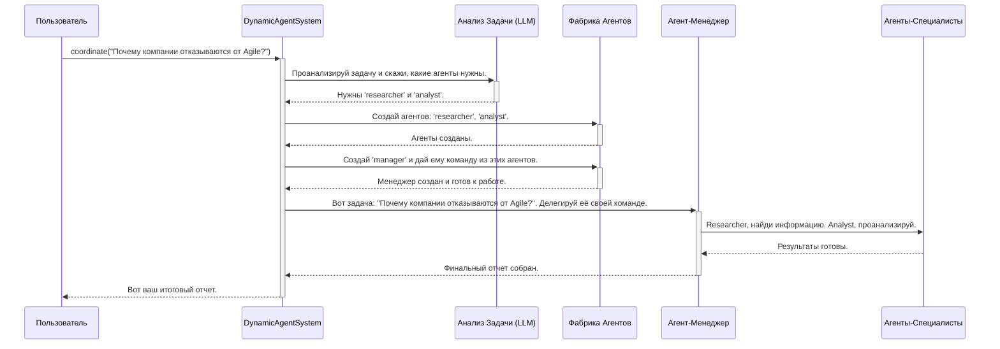

# Chapter 1: Система управления агентами (DynamicAgentSystem)


Добро пожаловать в мир `MultiAgent`! В этом курсе мы разберем, как построить сложную систему, где множество интеллектуальных "агентов" работают вместе для решения комплексных задач. И начнем мы с самого сердца нашей системы.

Представьте, что вам нужно построить дом. Вы же не будете сами класть кирпичи, проводить электричество и проектировать водопровод? Скорее всего, вы наймете руководителя проекта. Он поймет вашу задачу, найдет нужных специалистов (каменщика, электрика, сантехника), поставит им задачи и проконтролирует, чтобы всё было сделано качественно и в срок.

В нашем проекте роль такого руководителя выполняет **`DynamicAgentSystem`**.

## Что такое `DynamicAgentSystem`?

`DynamicAgentSystem` — это главный "дирижер" или "менеджер проекта" всей нашей системы. Он получает от вас общую, высокоуровневую задачу (например, "проанализируй последние тенденции в области искусственного интеллекта"), а затем организует всю работу для её выполнения.

Вот его ключевые обязанности:

1.  **Анализ Задачи**: Он изучает ваш запрос, чтобы понять, какие "профессиональные навыки" потребуются для ответа.
2.  **Формирование Команды**: Определив нужные навыки, он обращается к [Фабрике Агентов (AgentFactory)](02_фабрика_агентов__agentfactory__.md), чтобы "нанять" команду агентов-специалистов. Например, ему могут понадобиться `researcher` (исследователь) для поиска информации и `analyst` (аналитик) для её структурирования.
3.  **Координация Работы**: Он передает задачу главному в команде — агенту-менеджеру, который уже делегирует подзадачи специалистам.
4.  **Сбор Результатов**: После того как все агенты выполнили свою работу, `DynamicAgentSystem` собирает все результаты в единый, понятный отчет и предоставляет его вам.

Проще говоря, `DynamicAgentSystem` — это та точка входа, с которой вы взаимодействуете. Вы даете ему задачу, а он возвращает вам готовое решение.

## Как это использовать?

Работать с `DynamicAgentSystem` очень просто. Весь сложный процесс скрыт "под капотом". Взгляните на файл `main.py` — это всё, что нужно для запуска системы.

```python
// main.py

import asyncio
from agent_system import DynamicAgentSystem

async def main():
    # 1. Создаем экземпляр нашей системы
    system = DynamicAgentSystem()
    
    # 2. Формулируем нашу сложную задачу
    complex_task = "Почему компании массово отказываются от Agile методологии?"

    # 3. Запускаем координацию и ждем результат
    content = await system.coordinate(complex_task)
    
    print(content)
```

Давайте разберем этот код по шагам:

1.  `system = DynamicAgentSystem()`: Мы создаем нашего "менеджера проекта". Он готов к работе.
2.  `complex_task = "..."`: Мы определяем задачу, которую хотим решить. Это может быть любой сложный вопрос.
3.  `await system.coordinate(complex_task)`: Это самая важная строка. Мы передаем нашу задачу системе и просим её начать "координировать" выполнение.

**Что произойдет после запуска?**

Система оживет! `DynamicAgentSystem` проанализирует задачу, создаст необходимых агентов (например, "Исследователя" для поиска статей об Agile и "Аналитика" для выявления причин), организует их работу и в итоге выведет в консоль подробный отчет, отвечающий на ваш вопрос.

## Как это работает "под капотом"?

Давайте заглянем внутрь `DynamicAgentSystem` и посмотрим, что происходит после вызова метода `coordinate()`. Весь процесс можно представить в виде простой диаграммы.



Теперь рассмотрим ключевые фрагменты кода из файла `agent_system.py`, которые реализуют эту логику.

### Шаг 1: Анализ задачи

Все начинается с анализа вашей задачи. `DynamicAgentSystem` использует для этого мощную языковую модель (LLM).

```python
// agent_system.py -> метод coordinate()

async def coordinate(self, initial_task: str, ...):
    # ...
    # Анализируем задачу, чтобы понять, какие агенты нам нужны.
    agent_types, pipeline_type = await self.analyze_task(initial_task)
    # ...
```

Метод `analyze_task` отправляет специальный запрос к LLM, который возвращает список типов агентов (например, `['researcher', 'analyst', 'manager']`), идеально подходящих для решения именно этой задачи.

### Шаг 2: Создание команды агентов

Получив список необходимых специалистов, `DynamicAgentSystem` использует [Фабрику Агентов (AgentFactory)](02_фабрика_агентов__agentfactory__.md) для их создания.

```python
// agent_system.py -> метод coordinate()

# Создаем агентов-специалистов по списку
for agent_type in agent_types:
    if agent_type != 'manager':
        # Фабрика создает и настраивает каждого агента
        agent = self.factory.create_agent(agent_type, ...)
        self.agent_pool[agent.name] = {'agent': agent}
```

Здесь система в цикле проходит по списку `agent_types` и просит фабрику создать каждого агента.

### Шаг 3: Назначение и запуск менеджера

Команда не может работать без руководителя. Поэтому, когда все специалисты "наняты", система создает главного — `manager-agent`.

```python
// agent_system.py -> метод coordinate()

# Создаем менеджера последним, когда его команда уже собрана
manager_agent = self.factory.create_agent('manager', ...)

# Запускаем менеджер-агента, передавая ему основную задачу
answer = manager_agent.run(manager_instructions)
```

Обратите внимание: менеджер создается **последним**. Это важно, потому что при создании ему передается уже готовая команда агентов-специалистов. После этого метод `run()` запускает весь процесс делегирования и решения задачи.

### Шаг 4: Формирование итогового отчета

Когда `manager_agent` закончит свою работу и вернет `answer`, `DynamicAgentSystem` собирает всю информацию воедино и готовит финальный отчет для вас.

```python
// agent_system.py -> метод coordinate()

# ...
# Модифицируем формирование отчета
report = []
report.append("=== ИТОГОВЫЙ ОТЧЕТ ===\n")
report.append(f"🔍 Исходная задача: {initial_task}")

# Добавляем подробный ответ от менеджера
report.append("  ℹ️ Ответ менеджера:")
report.append(f"Подробный отчет:\n{answer}")

return "\n".join(report)
```

Этот код собирает все части головоломки вместе: исходную задачу, результаты работы каждого агента (здесь для простоты показан только ответ менеджера) и представляет их в удобном для чтения виде.

## Заключение

В этой главе мы познакомились с `DynamicAgentSystem` — мозговым центром и главным дирижером нашего проекта. Мы узнали, что он:

-   Выполняет роль "менеджера проекта".
-   Анализирует задачу и определяет, какие специалисты нужны.
-   Динамически создает команду агентов.
-   Координирует их работу для достижения цели.
-   Собирает итоговый отчет.

Теперь, когда мы понимаем, кто управляет всем оркестром, самое время узнать, как создаются сами "музыканты". В следующей главе мы подробно разберем, как работает "отдел кадров" нашей системы.

Перейдем к изучению [Главы 2: Фабрика Агентов (AgentFactory)](02_фабрика_агентов__agentfactory__.md).

---
