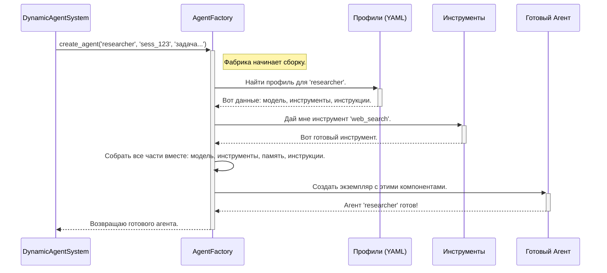

# Chapter 2: Фабрика Агентов (AgentFactory)


В [предыдущей главе](01_система_управления_агентами__dynamicagentsystem__.md) мы познакомились с `DynamicAgentSystem` — главным "менеджером проекта", который координирует всю работу. Мы узнали, что когда ему поступает задача, он определяет, какие специалисты нужны, и просит их "нанять". Но кто же занимается этим наймом? Кто собирает агентов по частям, как конструктор?

За эту задачу отвечает `AgentFactory`, или "Фабрика Агентов". Если `DynamicAgentSystem` — это руководитель проекта, то `AgentFactory` — это его отдел кадров, который умеет быстро находить и подготавливать нужных сотрудников.

## Что такое `AgentFactory`?

Представьте, что вы собираете команду для съемок фильма. Вам нужен режиссер, оператор, сценарист. У каждого из них своя роль, свои инструменты (камера, печатная машинка) и свои инструкции. `AgentFactory` — это кастинг-директор и менеджер по оборудованию в одном лице.

Её основная задача — автоматизировать создание и настройку агентов. Вместо того чтобы каждый раз вручную писать код для нового агента, мы просто говорим фабрике: "Мне нужен агент типа `researcher`", и она делает всё остальное:

1.  **Читает "профиль"**: Фабрика находит "личное дело" (конфигурационный файл) для `researcher`. В нем описано всё: его должностные обязанности, какими инструментами он должен владеть и какой у него уровень интеллекта (какую модель ИИ использовать).
2.  **Выдает "инструменты"**: Согласно профилю, фабрика подключает к агенту необходимые инструменты, например, доступ к поисковой системе.
3.  **Формирует "инструкции"**: Она создает для агента подробную инструкцию (промпт), объясняя его роль и цели.
4.  **Подключает "память"**: Каждому агенту выделяется персональная память, чтобы он мог учиться на основе предыдущих действий.
5.  **"Собирает" агента**: Наконец, она объединяет всё это в единый, готовый к работе объект-агент.

Такой подход делает систему невероятно гибкой. Нужно добавить нового специалиста? Просто создайте для него новый файл-профиль, и фабрика научится его "собирать"!

## Как это работает?

Напрямую с `AgentFactory` вы, как пользователь, почти не взаимодействуете. Эту работу за вас делает `DynamicAgentSystem`. Но важно понимать, как происходит этот процесс.

Вот как `DynamicAgentSystem` использует фабрику для создания агента-исследователя:

```python
// Этот код находится внутри DynamicAgentSystem
// Предположим, у нас уже есть экземпляр фабрики
self.factory = AgentFactory()

# ...

# Просим фабрику создать агента типа 'researcher' для текущей сессии
researcher_agent = self.factory.create_agent(
    profile_type='researcher', 
    session_id='session_123',
    task='Найти информацию о методологии Agile'
)
```

Разберем параметры:

*   `profile_type='researcher'`: Мы говорим фабрике, какой "чертеж" использовать. Это ключ, по которому она найдет нужный [профиль агента](03_профили_агентов__agent_profiles__.md).
*   `session_id='session_123'`: Уникальный идентификатор текущей задачи. Он нужен, чтобы память у агентов из разных задач не перемешивалась.
*   `task='...'`: Сама задача, которая поможет фабрике лучше настроить инструкции для агента.

В результате `researcher_agent` — это полностью сконфигурированный и готовый к работе объект.

## Что происходит "под капотом"?

Процесс создания агента можно сравнить со сборочной линией на заводе. Давайте посмотрим на основные этапы этого конвейера.



Теперь заглянем в код файла `agent_factory.py`, чтобы увидеть, как это реализовано.

### Шаг 1: Найти "профиль" агента

Все начинается с метода `create_agent`. Первым делом он ищет нужный профиль в глобальном словаре `AGENT_PROFILES`.

```python
# agent_factory.py -> метод create_agent()

def create_agent(self, profile_type: str, ...):
    
    if profile_type not in AGENT_PROFILES:
        raise ValueError(f"Неизвестный тип профиля: {profile_type}")
    
    # Загружаем "чертеж" из словаря AGENT_PROFILES
    profile = AGENT_PROFILES[profile_type]
    
    # ... дальнейшая сборка ...
```

`AGENT_PROFILES` — это специальная переменная, которая загружает все `.yaml` файлы из папки `agent_profiles`. Каждый файл — это "чертеж" для одного типа агента. Подробнее мы разберем это в [следующей главе](03_профили_агентов__agent_profiles__.md).

### Шаг 2: Подготовить инструменты

В профиле указан список инструментов, которые нужны агенту. Фабрика берет этот список и "выдает" агенту каждый инструмент.

```python
# agent_factory.py -> метод create_agent()

# Получаем список названий инструментов из профиля
profile_tools = profile.get('tools', [])

# Создаем реальные объекты инструментов для каждого названия
tools = [self._create_tool(tool_name) for tool_name in profile_tools]
```

Метод `_create_tool` находит нужный инструмент в общем реестре. Это позволяет нам централизованно управлять всеми доступными в системе инструментами, о чем мы поговорим в главе [Система загрузки инструментов (load\_tools)](05_система_загрузки_инструментов__load_tools__.md).

### Шаг 3: Настроить память

Каждому агенту нужна своя память, чтобы он не забывал, что делал на предыдущих шагах. Фабрика создает персональный экземпляр памяти для каждого.

```python
# agent_factory.py -> метод create_agent()

# Создаем RAG-память
rag_memory = create_rag_memory(
    session_id=session_id,
    agent_name=agent_id,
    profile_config=profile # Передаем профиль для настройки политик памяти
)
```

Здесь мы используем `create_rag_memory` для создания умной памяти, которая умеет не только хранить, но и находить релевантную информацию. Подробнее об этом в главе [Система памяти RAG (RagMemory)](04_система_памяти_rag__ragmemory__.md).

### Шаг 4: Собрать финальный экземпляр агента

Когда все компоненты готовы — модель ИИ, инструменты, память и инструкции — фабрика собирает их вместе, создавая объект агента (`CodeAgent` или `ToolCallingAgent`).

```python
# agent_factory.py -> метод create_agent()

# Создаем композитный промпт (инструкции)
composite_prompt = _build_composite_prompt(profile, ...)

# Финальная сборка! Создаем экземпляр агента
agent = CodeAgent(
    tools=tools,
    model=profile.get('model'),
    instructions=composite_prompt,
    # ... другие параметры ...
)

# Заменяем стандартную память на нашу RAG-память
agent.memory = rag_memory
```

Этот код — кульминация всего процесса. Он как будто защелкивает последнюю деталь конструктора. Теперь `agent` — это полностью автономная единица, готовая к выполнению задач.

## Заключение

В этой главе мы разобрали `AgentFactory` — один из самых важных механизмов, обеспечивающих гибкость и масштабируемость нашего проекта. Мы узнали, что фабрика:

-   Действует как "отдел кадров", который автоматически собирает агентов.
-   Использует "профили" как чертежи для сборки.
-   Оснащает агентов необходимыми инструментами, моделью ИИ, памятью и инструкциями.
-   Позволяет легко добавлять в систему новых агентов-специалистов, не меняя основной код.

Теперь, когда мы понимаем, *как* агенты создаются, самое время подробно изучить те самые "чертежи", по которым их собирают.

Переходим к [Главе 3: Профили агентов (AGENT_PROFILES)](03_профили_агентов__agent_profiles__.md).

---
