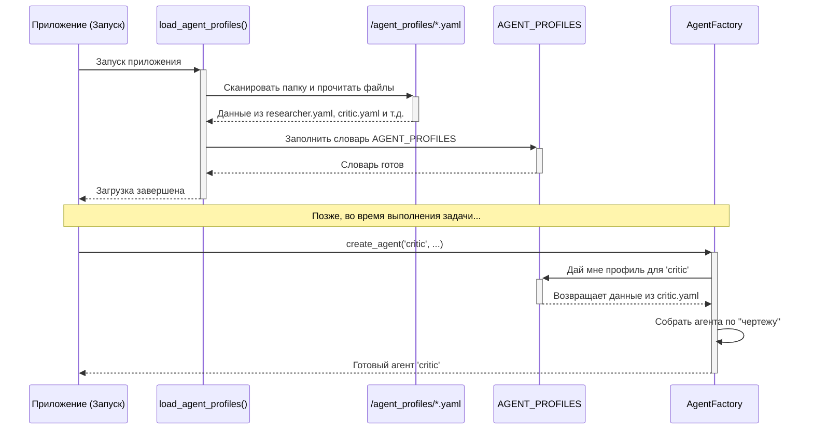

# Chapter 3: Профили агентов (AGENT_PROFILES)


В [предыдущей главе](02_фабрика_агентов__agentfactory__.md) мы узнали, как `AgentFactory` работает в качестве "отдела кадров", собирая и настраивая для нас агентов. Мы упомянули, что фабрика использует специальные "профили" или "чертежи" для каждого типа агента. Но что это за чертежи и как они выглядят?

Пришло время заглянуть в папку с "личными делами" наших агентов и познакомиться с `AGENT_PROFILES` — конфигурационными файлами, которые делают нашу систему такой гибкой и простой в настройке.

## Что такое профиль агента и зачем он нужен?

Представьте, что вы нанимаете нового сотрудника. Вам нужна **должностная инструкция**, в которой четко прописано:
*   **Должность**: "Аналитик данных".
*   **Обязанности**: "Собирать данные, строить отчеты, находить закономерности".
*   **Необходимые инструменты**: "Доступ к базе данных, лицензия на Tableau, Python".
*   **Квалификация**: "Должен уметь работать с большими моделями ИИ".

**Профили агентов** — это и есть такие должностные инструкции для наших цифровых сотрудников. Они хранятся в простых текстовых файлах формата YAML и описывают всё, что нужно `AgentFactory` для создания полностью готового к работе агента.

Главное преимущество такого подхода — **гибкость**. Вам нужен новый тип агента? Например, переводчик? Вам не нужно лезть в сложный код `AgentFactory`. Вы просто создаете новый YAML-файл, описываете в нем роль и инструменты "переводчика", и система автоматически научится его создавать!

## Анатомия профиля: заглянем в файл

Профили хранятся в папке `agent_profiles/`. Давайте рассмотрим в качестве примера содержимое файла `researcher.yaml`. Это профиль для нашего агента-исследователя.

```yaml
# agent_profiles/researcher.yaml

# Тип агента: tool_calling может вызывать несколько инструментов одновременно
type: tool_calling

# Описание роли: для чего этот агент нужен?
description: "Ищет информацию в интернете по заданному вопросу, анализирует веб-страницы."

# Модель ИИ: какой "мозг" будет использовать агент
model: model_search

# Инструменты: какими навыками и инструментами он владеет
tools:
  - web_search
  - webpage_content

# Политика памяти: как агент будет использовать свою память
memory_policy:
  # Давать краткую сводку предыдущих действий, чтобы лучше понимать контекст
  provide_run_summary: true
  # Включить семантический поиск по памяти при старте
  search_enabled: true

# Инструкции: базовый промпт, определяющий его поведение
prompt_templates: |
  Ты — элитный исследователь.
  Твоя задача — найти наиболее точную и релевантную информацию по запросу.
  Используй свои инструменты для поиска и анализа.
  Отвечай четко и по существу.
```

Давайте разберем этот файл по частям:

*   `type`: Указывает тип базового агента. Например, `tool_calling` лучше справляется с вызовом инструментов.
*   `description`: Краткое описание роли агента. `DynamicAgentSystem` использует его, чтобы понять, какой специалист лучше подойдет для задачи.
*   `model`: "Мозг" агента. Здесь мы указываем, какую из наших предварительно настроенных моделей ИИ (например, `model_search`, `model_code`) следует использовать.
*   `tools`: Список "инструментов", которые будут доступны агенту. В данном случае, это `web_search` для поиска в интернете и `webpage_content` для чтения содержимого страниц. Подробнее об инструментах мы поговорим в главе [Система загрузки инструментов (load_tools)](05_система_загрузки_инструментов__load_tools__.md).
*   `memory_policy`: Настройки памяти агента. Например, `provide_run_summary: true` говорит агенту, что перед началом работы ему нужно освежить в памяти краткое содержание своих прошлых действий. Об этом подробнее в главе [Система памяти RAG (RagMemory)](04_система_памяти_rag__ragmemory__.md).
*   `prompt_templates`: Самое главное — "должностная инструкция" или системный промпт. Этот текст определяет личность, цели и стиль поведения агента.

## Как система загружает и использует профили?

Когда приложение запускается, специальная функция `load_agent_profiles` в файле `agent_command.py` делает очень простую вещь: она сканирует папку `agent_profiles/`, читает каждый `.yaml` файл и складывает все данные в один большой словарь под названием `AGENT_PROFILES`.

```python
# agent_command.py

def load_agent_profiles():
    profiles = {}
    profile_dir = 'agent_profiles' # Папка с нашими профилями
    for filename in os.listdir(profile_dir):
        if filename.endswith('.yaml'):
            # Имя файла без .yaml становится ключом (например, 'researcher')
            agent_name = filename[:-5] 
            # ...здесь происходит чтение и загрузка YAML-файла...
            profiles[agent_name] = profile_data
    return profiles

# Глобальный словарь, доступный всей системе
AGENT_PROFILES = load_agent_profiles()
```

Теперь, когда `AgentFactory` получает команду создать агента, она просто заглядывает в этот готовый словарь.

```python
# agent_factory.py -> метод create_agent()

def create_agent(self, profile_type: str, ...):
    # 'profile_type' здесь — это, например, 'researcher'
    
    # 1. Загружаем "чертеж" из глобального словаря
    profile = AGENT_PROFILES[profile_type]
    
    # 2. Используем данные для сборки
    model = profile.get('model')
    tools_list = profile.get('tools', [])
    # ... и так далее
```

Этот механизм элегантен и прост. `AgentFactory` не нужно знать о существовании каких-то конкретных агентов. Ей достаточно получить имя профиля и найти его в словаре `AGENT_PROFILES`.

## Давайте создадим нового агента!

Чтобы увидеть всю мощь этого подхода, давайте добавим в нашу систему совершенно нового специалиста — **критика**. Его задача будет состоять в том, чтобы оценивать готовый ответ другого агента и предлагать улучшения.

**Шаг 1: Создаем новый YAML-файл**

В папке `agent_profiles/` создайте новый файл с именем `critic.yaml`.

**Шаг 2: Заполняем профиль**

Добавьте в `critic.yaml` следующее содержимое:

```yaml
# agent_profiles/critic.yaml

type: code
description: "Оценивает и критикует предоставленный текст или ответ, чтобы улучшить его качество."
model: model_lite # Нам не нужна самая мощная модель для этой задачи

tools: [] # Критику не нужны внешние инструменты, он работает только с текстом

memory_policy:
  provide_run_summary: false
  search_enabled: false

prompt_templates: |
  Ты — строгий, но справедливый критик.
  Твоя цель — не просто найти недостатки, а предложить конструктивные улучшения.
  Проанализируй предоставленный тебе текст.
  Выдели сильные стороны, укажи на слабые и предложи конкретные шаги для улучшения.
```

**Шаг 3: Готово!**

Невероятно, но это всё. Вам не нужно писать ни строчки кода на Python. Просто перезапустите приложение. `load_agent_profiles` автоматически обнаружит новый файл `critic.yaml`, и `AgentFactory` научится создавать агента-критика. Теперь `DynamicAgentSystem` при анализе задачи сможет решить, что для получения высококачественного ответа полезно "нанять" критика для финальной проверки.

Этот пример отлично показывает, как профили отделяют **конфигурацию** агентов от **логики** их создания.

## Как это работает "под капотом"

Весь процесс можно представить на простой схеме, которая показывает, как данные из файлов превращаются в работающего агента.



## Заключение

В этой главе мы разобрали один из ключевых элементов, обеспечивающих гибкость нашей системы, — профили агентов. Мы узнали, что:

-   Профили — это YAML-файлы, которые работают как "должностные инструкции" для агентов.
-   Они описывают роль, инструменты, модель ИИ и базовые инструкции для каждого типа агента.
-   Система автоматически загружает все профили при старте, создавая глобальный словарь `AGENT_PROFILES`.
-   Такой подход позволяет легко добавлять, изменять и настраивать агентов, не трогая основной код программы.

Мы поняли, *что* такое агент и *как* он настраивается. Но для эффективной работы агентам нужна способность учиться на своем опыте. Им нужна память.

В следующей главе мы погрузимся в устройство "мозга" наших агентов и рассмотрим, как работает их система долгосрочной памяти. Переходим к изучению [Главы 4: Система памяти RAG (RagMemory)](04_система_памяти_rag__ragmemory__.md).

---

