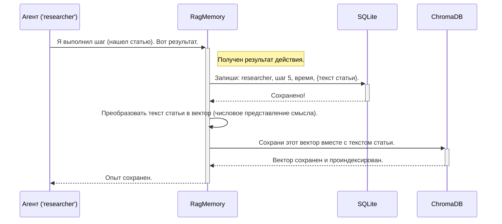
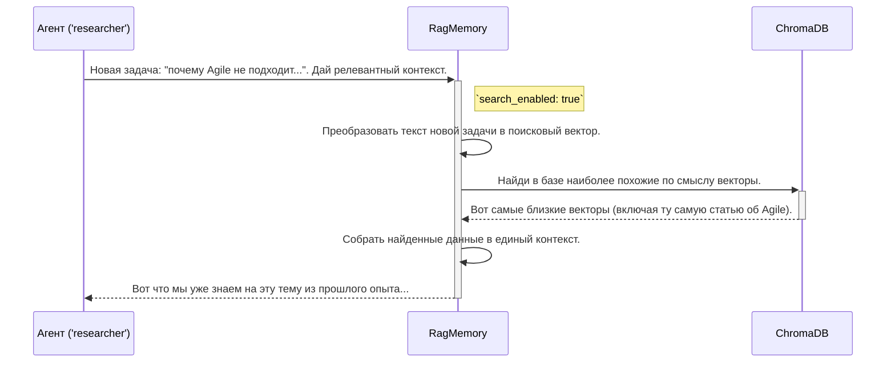

# Chapter 4: Система памяти RAG (RagMemory)


В [предыдущей главе](03_профили_агентов__agent_profiles__.md) мы детально разобрали "профили" — YAML-файлы, которые служат чертежами для создания наших агентов. Мы поняли, как описать их роли, инструменты и инструкции. Но даже самый квалифицированный специалист бесполезен, если он не способен учиться на своем опыте.

Представьте команду ученых, которая каждый день начинает свое исследование с чистого листа, забывая все вчерашние открытия, гипотезы и неудачные эксперименты. Такая команда никогда не добьется прорыва. Им нужна общая база знаний, лабораторные журналы и протоколы, чтобы двигаться вперед.

Для наших агентов роль такой коллективной памяти выполняет **`RagMemory`**.

## Что такое `RagMemory` и зачем она нужна?

Простая память может запомнить последовательность действий: "Шаг 1: поискал в интернете. Шаг 2: проанализировал текст". Но этого недостаточно. Что, если мы хотим спросить: "А что мы уже знаем о методологии Agile из предыдущих задач?". Простая память на такой вопрос не ответит.

`RagMemory` — это не просто записная книжка, а "умная общая библиотека" и "корпоративная память" для всех агентов. Она построена на технологии **Retrieval-Augmented Generation (RAG)**, что можно перевести как "Генерация, дополненная поиском".

Вот что это значит на практике:

1.  **Хранение (Storage)**: `RagMemory` надежно сохраняет каждое действие, результат и артефакт, созданный агентами, в базе данных.
2.  **Поиск (Retrieval)**: Когда появляется новая задача, система не просто смотрит на последние шаги. Она выполняет **семантический поиск** по всей базе знаний. Это значит, что она ищет не по ключевым словам, а по *смыслу*. Запрос "причины отказа от гибких методологий" найдет информацию, даже если в ней использовались слова "проблемы с эджайл" или "недостатки scrum".
3.  **Дополнение (Augmentation)**: Найденная релевантная информация (контекст из прошлого опыта) "дополняет" исходную задачу.
4.  **Генерация (Generation)**: Агент получает не только новую задачу, но и выжимку из релевантного прошлого опыта, что позволяет ему дать более глубокий и качественный ответ, не повторяя старых ошибок.

Проще говоря, `RagMemory` превращает нашу команду агентов в **обучающуюся систему**, которая с каждой решенной задачей становится "умнее" и опытнее.

## Как это настраивается?

К счастью, вся сложность RAG-системы скрыта "под капотом". Нам, как пользователям, не нужно писать сложные запросы к базе данных. Мы управляем поведением памяти через уже знакомые нам [профили агентов](03_профили_агентов__agent_profiles__.md).

Давайте взглянем на секцию `memory_policy` в файле `researcher.yaml`:

```yaml
# agent_profiles/researcher.yaml

# ... другие настройки ...

memory_policy:
  # Давать краткую сводку предыдущих действий, чтобы лучше понимать контекст
  provide_run_summary: true
  
  # Включить семантический поиск по памяти при старте
  search_enabled: true

  # Автоматически сжимать локальный контекст агента (in-memory)
  local_compact: true
  local_compact_every: 15
```

Разберем эти два параметра:

*   `search_enabled: true`: Этот флаг — ключ ко всей магии. Когда он включен, перед началом работы агент автоматически выполнит семантический поиск по всей истории, чтобы найти релевантный контекст для текущей задачи.
*   `provide_run_summary: true`: Эта опция говорит агенту, что в конце своей работы он должен создать краткое саммари (выжимку) о проделанной работе. Эти саммари тоже сохраняются в памяти и в будущем помогают другим агентам (или ему же) быстрее вникнуть в суть прошлых задач.
*   `local_compact: true` и `local_compact_every: 15`: Включают автоматическое сжатие локального контекста агента каждые N шагов. Это влияет только на оперативную память агента (in-memory) и не удаляет данные из базы.

Управляя этими простыми флагами в YAML-файлах, мы можем гибко настраивать, как каждый агент будет использовать свою память.

## Как это работает "под капотом"?

Процесс взаимодействия с `RagMemory` можно разделить на два основных сценария: **сохранение опыта** и **извлечение контекста**. За хранение структурированных данных (кто, что, когда сделал) отвечает база данных **SQLite**, а за "умный" семантический поиск — векторная база данных **ChromaDB**.

### Сценарий 1: Сохранение опыта

Представим, что агент `researcher` только что нашел статью об Agile.



### Сценарий 2: Получение релевантного контекста

Теперь представим, что через некоторое время менеджер ставит новую задачу: "Выясни, почему Agile не подходит крупным корпорациям".


Таким образом, агент начинает работу не с нуля, а уже имея на руках полезную информацию.

## Логика в коде

Давайте посмотрим на ключевые фрагменты кода, которые реализуют эту логику.

### Шаг 1: Создание `RagMemory`

Когда [Фабрика Агентов (AgentFactory)](02_фабрика_агентов__agentfactory__.md) создает нового агента, она также создает для него персональный экземпляр `RagMemory`, считывая настройки из профиля.

```python
# agent_factory.py -> метод create_agent()

# Создаем RAG-память (SQLite + ChromaDB) с политикой из профиля
rag_memory = create_rag_memory(
    session_id=session_id,
    agent_name=agent_id,
    profile_config=profile # Передаем конфигурацию для чтения memory_policy
)

# Заменяем стандартную память на нашу RagMemory
agent.memory = rag_memory
```
Функция `create_rag_memory` из файла `memory/rag_memory.py` читает секцию `memory_policy` и настраивает объект памяти с нужными правилами.

### Шаг 2: Сохранение шага

Мы не вызываем сохранение напрямую. Система использует "колбэки" — функции, которые автоматически вызываются после каждого действия агента.

```python
# agent_factory.py -> метод _build_step_callbacks()

def _save_step(memory_step, agent=None):
    # ...пропускаем подготовку данных...
    payload = {"smol_step_type": ...} # Данные шага
    
    # Сохраняем шаг в нашу RAG-систему
    agent.memory.add_step(payload)
```
Эта функция передает все данные о шаге в метод `add_step` нашего объекта `RagMemory`.

Внутри `RagMemory` метод `add_step` вызывает функцию `save_memory` (из файла `memory/tools.py`), которая уже распределяет данные: структурированную информацию в SQLite, а семантический вектор — в ChromaDB.

### Шаг 3: Получение контекста

Этот процесс тоже автоматизирован. Когда агент готовится выполнить задачу, специальная "обертка" `_wrap_write_memory_to_messages` в `agent_factory.py` перехватывает его обращение к памяти.

```python
# agent_factory.py -> метод _wrap_write_memory_to_messages()

def wrapped_write_memory_to_messages(summary_mode: bool = False):
    # ...
    # Проверяем, нужно ли выполнять семантический поиск (search_enabled: true)
    if is_first_step and agent.memory.policy.search_enabled:
        
        # Выполняем семантический поиск по тексту задачи
        task_search_results = agent.memory.search_memory(
            query=agent.memory.current_run_context
        )
        # ... здесь формируется контекст на основе найденного
    # ...
```
Метод `agent.memory.search_memory` (из `memory/rag_memory.py`) — это и есть тот самый поисковик, который обращается к ChromaDB, чтобы найти релевантную информацию из прошлого опыта.

## Заключение

В этой главе мы погрузились в устройство "мозга" нашей мультиагентной системы — `RagMemory`. Мы узнали, что:

-   Это не просто хранилище, а **умная система памяти** на базе RAG.
-   Она использует **SQLite** для структурированных данных и **ChromaDB** для семантического поиска по смыслу.
-   Это позволяет агентам **учиться на прошлом опыте**, находить релевантную информацию и не повторять ошибок.
-   Поведением памяти можно гибко управлять через политику `memory_policy` в **профилях агентов**.
-   Вся сложная логика сохранения и поиска **автоматизирована** и не требует ручного вмешательства.

Теперь, когда мы понимаем, как агенты создаются, настраиваются и обучаются, пришло время разобраться с их "руками" — инструментами, с помощью которых они взаимодействуют с внешним миром.

Переходим к изучению [Главы 5: Система загрузки инструментов (load_tools)](05_система_загрузки_инструментов__load_tools__.md).

---
