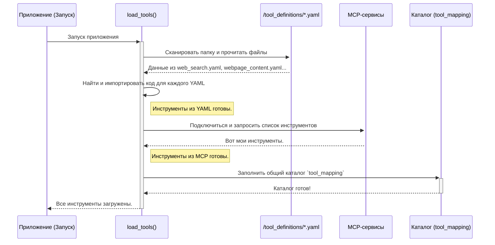

# Chapter 5: Система загрузки инструментов (load_tools)


В [предыдущей главе](04_система_памяти_rag__ragmemory__.md) мы разобрались, как агенты запоминают свой опыт с помощью умной памяти `RagMemory`. Теперь у них есть "мозг" и "память". Но чтобы выполнять реальную работу, им нужны "руки" — инструменты для взаимодействия с внешним миром.

Представьте, что вы наняли самого умного в мире исследователя. Он может анализировать, делать выводы и помнить всё. Но если запереть его в пустой комнате без книг, компьютера и телефона, он будет бесполезен. Ему нужны инструменты. Точно так же нашим агентам нужны инструменты, чтобы искать в интернете, выполнять код или рисовать диаграммы.

За выдачу этих инструментов отвечает **система загрузки инструментов** — наша "служба снабжения".

## Что такое система загрузки инструментов?

Это централизованный механизм, который при запуске приложения сканирует все доступные "навыки", собирает их в единый "каталог" и готовит к использованию. Когда [Фабрика Агентов (AgentFactory)](02_фабрика_агентов__agentfactory__.md) создает нового агента, она заглядывает в его [профиль](03_профили_агентов__agent_profiles__.md), видит, какие инструменты ему нужны (например, `web_search`), и берет их из этого общего каталога.

Система умеет "находить" инструменты из двух основных источников:

1.  **YAML-файлы**: Простые текстовые файлы в папке `tool_definitions/`, которые описывают инструмент и указывают, где находится его код. Это идеальный способ для добавления собственных, кастомных функций.
2.  **MCP-сервисы**: Внешние, готовые к использованию микросервисы, которые предоставляют более сложные возможности (например, работу с базами данных).

Такой подход делает нашу систему невероятно гибкой. Чтобы дать агентам новый навык, нам не нужно переписывать основной код. Достаточно просто описать новый инструмент в YAML-файле!

## Анатомия инструмента: смотрим на YAML-определение

Давайте посмотрим, как описан один из самых важных инструментов — `web_search` (поиск в интернете). Это файл `tool_definitions/web_search.yaml`.

```yaml
# tool_definitions/web_search.yaml

# Уникальное имя, по которому мы будем вызывать инструмент
name: web_search

# Откуда брать код для этого инструмента. 
# В данном случае, это обычная функция.
source_type: custom_function

# Путь к коду: 'папка.файл.имя_функции'
implementation_source: custom_tools.web_research.web_research
```

Разберем этот файл:

*   `name`: Имя инструмента. Именно это имя мы указываем в `tools` в [профиле агента](03_профили_агентов__agent_profiles__.md).
*   `source_type`: Тип источника. `custom_function` означает, что инструмент — это обычная функция в Python.
*   `implementation_source`: Путь к функции. Система понимает этот путь так: "в папке `custom_tools` найти файл `web_research.py`, а в нем — функцию `web_research`".

`AgentFactory` будет использовать эту информацию, чтобы найти и "выдать" нужную функцию агенту `researcher`.

## Как это работает "под капотом"?

Весь процесс можно разделить на два этапа: подготовка "каталога" при старте и выдача инструмента при создании агента.

### Этап 1: Загрузка всех инструментов (`load_tools`)

При запуске приложения вызывается функция `load_tools` из файла `agent_factory.py`. Она работает как кладовщик, который составляет инвентарный список всего, что есть на складе.



Давайте посмотрим на упрощенный код функции `load_tools`.

```python
# agent_factory.py -> функция load_tools()

def load_tools():
    tool_mapping = {} # Создаем пустой "каталог"
    tool_dir = 'tool_definitions'
    
    # Шаг 1: Загрузка из YAML-файлов
    for filename in os.listdir(tool_dir):
        if filename.endswith('.yaml'):
            # ... читаем YAML-файл ...
            tool_config = yaml.safe_load(f)
            tool_name = tool_config['name']
            source_path = tool_config['implementation_source']
            
            # ... импортируем функцию по пути ...
            module_path, func_name = source_path.rsplit('.', 1)
            module = importlib.import_module(module_path)
            func = getattr(module, func_name)
            
            # Добавляем инструмент в каталог
            tool_mapping[tool_name] = tool(func)

    # Шаг 2: Интеграция MCP-инструментов (более продвинутый способ)
    for mcp_tool_obj in mcp_tools:
        tool_mapping[mcp_tool_obj.name] = mcp_tool_obj
    
    return tool_mapping
```

Этот код выполняет две ключевые вещи:
1.  Он проходит по всем `.yaml` файлам в папке `tool_definitions`, динамически импортирует код функций, на которые они ссылаются, и складывает их в словарь `tool_mapping`.
2.  Затем он добавляет в этот же словарь готовые инструменты, полученные от MCP-сервисов.

В результате `tool_mapping` — это полный и готовый к использованию "каталог" всех навыков в системе.

### Этап 2: Выдача инструмента `AgentFactory`

Этот "каталог" используется внутри [Фабрики Агентов (AgentFactory)](02_фабрика_агентов__agentfactory__.md). Когда она создает агента, она вызывает свой внутренний метод `_create_tool`.

```python
# agent_factory.py -> AgentFactory

class AgentFactory:
    def __init__(self):
        # При создании фабрики мы сразу же загружаем все инструменты
        self.tool_mapping = load_tools()

    def _create_tool(self, tool_name: str):
        # Просто ищем инструмент по имени в нашем каталоге
        created_tool = self.tool_mapping.get(tool_name)
        if created_tool is None:
            logger.warning(f"ВНИМАНИЕ: Инструмент '{tool_name}' не найден.")
        return created_tool
```

Когда `AgentFactory` читает профиль `researcher` и видит в нем `tools: ['web_search']`, она вызывает `self._create_tool('web_search')`. Этот метод мгновенно находит в словаре `self.tool_mapping` нужный объект-инструмент и передает его создаваемому агенту.

## Пример: Добавим новый инструмент "Hello World"

Давайте увидим всю мощь этой системы, добавив простейший кастомный инструмент, который просто возвращает строку "Hello, World!".

**Шаг 1: Создаем Python-файл с логикой инструмента**

В папке `custom_tools/` создайте новый файл `greeting.py`:

```python
# custom_tools/greeting.py

def say_hello() -> str:
    """Простой инструмент, который возвращает приветствие."""
    return "Hello, World!"
```

**Шаг 2: Создаем YAML-файл с описанием инструмента**

В папке `tool_definitions/` создайте файл `greeting.yaml`:

```yaml
# tool_definitions/greeting.yaml

name: say_hello
source_type: custom_function
implementation_source: custom_tools.greeting.say_hello
```

**Шаг 3: Добавляем инструмент в профиль агента**

Откроем профиль агента, например `researcher.yaml`, и добавим ему новый навык:

```yaml
# agent_profiles/researcher.yaml

# ...
tools:
  - web_search
  - webpage_content
  - say_hello # <-- Наш новый инструмент
# ...
```

**Шаг 4: Готово!**

Это всё! Больше ничего делать не нужно. При следующем запуске `load_tools` автоматически обнаружит `greeting.yaml`, загрузит функцию `say_hello` и добавит ее в общий каталог. `AgentFactory` увидит `say_hello` в профиле исследователя и выдаст ему этот инструмент. Теперь наш `researcher` сможет выполнить новую для него задачу: "поприветствуй мир".

## Заключение

В этой главе мы познакомились с "сердцем" практических возможностей нашей системы — механизмом загрузки инструментов `load_tools`. Мы узнали, что:

-   Инструменты — это "руки" агентов, позволяющие им выполнять реальные действия.
-   Система `load_tools` при запуске создает единый "каталог" всех доступных в проекте инструментов.
-   Инструменты можно легко добавлять, описывая их в **YAML-файлах** в папке `tool_definitions` и указывая путь к их коду.
-   [Фабрика Агентов (AgentFactory)](02_фабрика_агентов__agentfactory__.md) использует этот каталог, чтобы динамически оснащать агентов нужными навыками в соответствии с их [профилями](03_профили_агентов__agent_profiles__.md).
-   Этот подход делает систему невероятно **гибкой и расширяемой**.

Наши агенты теперь полностью оснащены: у них есть инструкции, память и инструменты. Они готовы к выполнению сложных задач. Одна из таких задач — работа с базами данных.

В следующей главе мы рассмотрим, как наши агенты используют специализированный набор инструментов для понимания запросов на естественном языке и преобразования их в SQL-запросы к базам данных. Переходим к изучению [Главы 6: Пайплайн Text-to-SQL](06_пайплайн_text_to_sql_.md).

---
