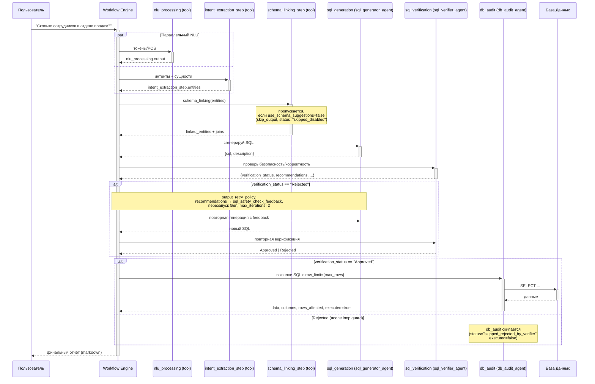

# Chapter 6: Пайплайн Text-to-SQL


В [предыдущей главе](05_система_загрузки_инструментов__load_tools__.md) мы узнали, как наша система снабжает агентов "руками" — инструментами для взаимодействия с внешним миром. Теперь у агентов есть всё необходимое для выполнения широкого круга задач. Но что, если задача очень специфична и требует глубоких знаний в определенной области?

Представьте, что вы хотите задать вопрос о данных вашей компании, например: "Покажи мне топ-5 самых продаваемых продуктов в прошлом месяце". Без специальных знаний вам пришлось бы просить аналитика написать сложный SQL-запрос. А что, если бы агент мог сделать это за вас?

Именно для этой цели в `MultiAgent` существует **Пайплайн Text-to-SQL** — узкоспециализированный "конвейер", который преобразует ваши вопросы на естественном языке в готовые к выполнению SQL-запросы. Это одна из самых мощных и проработанных функций проекта.

## Что такое Пайплайн Text-to-SQL?

Пайплайн (или "конвейер") Text-to-SQL — это последовательность шагов, которую выполняет система, чтобы понять ваш вопрос о данных и получить на него ответ из базы данных. Каждый шаг — это отдельный мини-агент или инструмент со своей зоной ответственности.

Представьте себе сборочную линию на заводе:
1.  **Начало линии:** Поступает "сырье" — ваш вопрос: "Сколько у нас клиентов из Москвы?".
2.  **Первый этап (Понимание):** Рабочий анализирует вопрос и определяет, что нужно "посчитать" (`COUNT`) сущность "клиенты" (`customers`) при условии, что их "город" (`city`) — это "Москва".
3.  **Второй этап (Сопоставление):** Другой рабочий, имея на руках "чертеж" базы данных, находит, что "клиенты" — это таблица `customers`, а "город" — это колонка `city` в этой таблице.
4.  **Третий этап (Сборка):** Инженер собирает из этих деталей "деталь" на языке SQL: `SELECT COUNT(*) FROM customers WHERE city = 'Москва';`.
5.  **Четвертый этап (Контроль качества):** Инспектор проверяет, что в SQL-коде нет опасных команд (вроде `DROP TABLE`), и что он синтаксически корректен.
6.  **Пятый этап (Исполнение):** Проверенный SQL-запрос отправляется к станку (базе данных), который его выполняет.
7.  **Конец линии:** Вы получаете готовый "продукт" — ответ: "1,250".

Этот конвейер позволяет вам "общаться" с базой данных на человеческом языке, полностью скрывая от вас техническую сложность SQL.

## Как работает конвейер?

Весь процесс описан как декларативный YAML-флоу в [`workflow_pipelines/text_to_sql_pipeline.yaml`](../../workflow_pipelines/text_to_sql_pipeline.yaml). После декомпозиции из EPIC 6.3 ранее единый шаг-менеджер `sql_pipeline` разбит на **три отдельных агентных шага**: генератор SQL, верификатор и аудитор БД. NLU обрабатывается параллельно двумя инструментальными шагами, schema linking — опциональный шаг-инструмент.



## Как запустить пайплайн?

Единственный официальный путь запуска — через AG-UI preset `presets.text_to_sql.generate` (см. [`doc/AG_UI_SERVICE_ACTIONS.md`](../AG_UI_SERVICE_ACTIONS.md)). После рефакторинга UI (EPIC 6.10) альтернативных entry-point'ов фронтенд больше не использует: и Streamlit, и React-клиент дёргают именно этот preset.

Preset принимает inputs пайплайна (`query`, `dsn`, `max_rows`, `dry_run_only`, `use_schema_suggestions`, `session_id`, `run_id` и т.д.) и возвращает финальный markdown-отчёт из `outputs.final` (источник — `db_audit.output`). Подробный список inputs/outputs и значения по умолчанию — в [Главе 17](MultiAgent/17_text_to_sql_pipeline.md).

## Агенты пайплайна

| Шаг | Профиль агента | Роль |
|---|---|---|
| `sql_generation` | [`sql_generator_agent`](../../agent_profiles/sql_generator_agent.yaml) | Генерирует SQL по запросу + NLU + schema linking. Возвращает `{sql, description}`. Учитывает `sql_safety_check_feedback` при rerun. |
| `sql_verification` | [`sql_verifier_agent`](../../agent_profiles/sql_verifier_agent.yaml) | Проверяет SQL на безопасность и корректность. Возвращает `verification_status` (Approved/Rejected) и `recommendations`. |
| `db_audit` | [`db_audit_agent`](../../agent_profiles/db_audit_agent.yaml) | Выполняет одобренный SQL через `secure_db_executor` с `row_limit={max_rows}`, маскирует PII, пишет audit-лог. При `dry_run_only=true` возвращает `executed=false`, `status="skipped"`. |
| `schema_linking_step` (tool) | — / [`schema_rag_agent`](../../agent_profiles/schema_rag_agent.yaml) (когда нужна агентная обвязка) | Связывает сущности со схемой БД через RAG. |

NLU-шаги (`nlu_processing`, `intent_extraction_step`) — это шаги типа `tool`, без выделенного агента; описание есть в [`agent_profiles/nlu_agent.yaml`](../../agent_profiles/nlu_agent.yaml), который продолжает использоваться в data_analysis-пайплайнах (см. EPIC 6.8).

## Что происходит "под капотом"?

Вся логика инструментов и агентов пайплайна живёт в пакете [`custom_tools/text_to_sql/`](../../custom_tools/text_to_sql/). Совместимый фасад с прежним именем — [`custom_tools/sql_tools.py`](../../custom_tools/sql_tools.py) — реэкспортирует функции, чтобы старые импорты `from custom_tools.sql_tools import ...` продолжали работать.

Давайте рассмотрим ключевые функции для каждого этапа.

### Шаг 1: Понимание запроса (NLU)

Все начинается с анализа вашего вопроса. Для этого используется функция `natural_language_processing`.

```python
# custom_tools/text_to_sql/core.py

def natural_language_processing(text: str) -> Dict[str, List[str]]:
    """LLM-анализ текста: токены и простые POS-теги."""
    # ... использует LLM для разбора предложения ...
    return nlu_processor.process_text(text)
```

Эта функция берет ваш текст ("Сколько сотрудников в отделе продаж?") и с помощью языковой модели (LLM) разбивает его на смысловые части (токены), определяя, что "сколько" — это вопрос о количестве, а "сотрудники" и "отдел продаж" — ключевые сущности.

### Шаг 2: Связывание со схемой (Schema Linking)

Это самый сложный и важный этап. Системе нужно понять, как слова из вашего запроса соотносятся с реальной структурой базы данных. Этим занимается функция `schema_linking`.

```python
# custom_tools/text_to_sql/core.py

def schema_linking(entities: Dict[str, object]) -> Dict[str, object]:
    """LLM-схемный линкинг с авто-интроспекцией..."""
    # ... сопоставляет "сотрудники" с таблицей `employees` ...
    from .schema_linker import SchemaLinker
    linker = SchemaLinker(...)
    return linker.link_entities_to_schema(entities, {})
```

Она берет сущности ("сотрудники", "отдел продаж") и "смотрит" на схему базы данных, чтобы найти наиболее подходящие таблицы и колонки. Этот процесс использует [Интроспекцию и обогащение схемы БД](08_интроспекция_и_обогащение_схемы_бд_.md) для получения актуальной информации о структуре базы.

Шаг управляется флагом `use_schema_suggestions`. Если он `false`, `schema_linking_step` пропускается и подставляется заранее заданный `skip_output` с `status: "skipped_disabled"` (см. EPIC 6.9) — генератор SQL увидит «пустой» linked_entities и сработает без подсказок схемы.

### Шаг 3: Генерация SQL

Когда система точно знает, какие таблицы и колонки использовать, она готова сгенерировать SQL-код. Этим занимается отдельный агент `sql_generator_agent`, который через свой инструмент `sql_generation_plugin` обращается к LLM:

```python
# custom_tools/text_to_sql/core.py

def sql_generation_plugin(context: str, user_query: str) -> Dict[str, str]:
    """LLM-генерация SQL из linked_entities..."""
    # ... просит LLM написать SQL на основе контекста ...
    from .sql_generator import SQLGenerator
    generator = SQLGenerator()
    return generator.generate_sql(context, user_query)
```

Эта функция отправляет LLM подробное задание: "Напиши SQL-запрос, который посчитает количество записей в таблице `employees`, соединенной с таблицей `departments`, где имя департамента равно 'Sales'". В результате мы получаем готовый SQL — агент возвращает его как JSON `{sql, description}`.

### Шаг 4: Проверка на безопасность

Прежде чем выполнять какой-либо код, полученный от LLM, его нужно проверить. Этим занимается агент `sql_verifier_agent`, использующий инструмент `sql_safety_check`:

```python
# custom_tools/text_to_sql/core.py

def sql_safety_check(sql_query: str) -> Dict[str, object]:
    """Комбинированная проверка: статическая + LLM-флагование рисков."""
    # ... проверяет SQL на наличие опасных команд ...
    safety_result = sql_validator.validate(sql_query)
    # ...
    return safety_result
```

Внутри проверка построена на классе `SQLSafetyValidator`, конфигурация которого вынесена в [`config/text_to_sql/safety.yaml`](../../config/text_to_sql/safety.yaml). Список запрещённых ключевых слов профиля `default`:

```text
INSERT, UPDATE, DELETE, DROP, TRUNCATE, ALTER, CREATE, REPLACE,
VACUUM, ATTACH, DETACH, GRANT, REVOKE, PRAGMA, CALL, EXEC,
EXECUTE, MERGE, COPY
```

Профиль `strict` дополнительно блокирует `SET`, `RESET`, `USE`, `SHOW`, `ANALYZE` и ужесточает `max_query_length`/`max_in_list_size`. Активный профиль выбирается через переменную окружения `TEXT_TO_SQL_SAFETY_PROFILE`.

Если в сгенерированном SQL найдётся хотя бы одно из этих слов, верификатор вернёт `verification_status: "Rejected"` вместе с `recommendations` — конкретными подсказками, как переписать запрос. Эти подсказки автоматически прокидываются обратно в `sql_generator_agent` через переменную `sql_safety_check_feedback` (`output_retry_policy`, `max_iterations=2`), и генератор пробует ещё раз. Если после `max_iterations` SQL так и не одобрен, `db_audit` пропускается, и пользователь получает явный отказ.

### Шаг 5: Безопасное выполнение

Только после успешной проверки SQL-запрос отправляется на выполнение в базу данных. Этим занимается агент `db_audit_agent`, который вызывает `secure_db_executor`:

```python
# custom_tools/text_to_sql/core/_db_exec.py

def secure_db_executor(sql_query: str, row_limit: int | None = None, ...) -> Dict[str, object]:
    """Безопасное выполнение SELECT/DESCRIBE/EXPLAIN через плагины."""
    # ...
    plugin = get_plugin(dsn)
    conn = plugin.connect(dsn)
    try:
        return plugin.execute_select(conn, sql_query, row_limit=row_limit)
    finally:
        plugin.close(conn)
```

Эта функция не выполняет запрос напрямую. Она использует [Систему плагинов для баз данных (DB Plugins)](07_система_плагинов_для_баз_данных__db_plugins__.md), чтобы безопасно подключиться к базе данных. Важно, что лимит на количество возвращаемых строк параметризуется: значение приходит из inputs пайплайна как `max_rows` (default = 100, max = 10000), и `db_audit_agent` обязан передать его в `secure_db_executor` как `row_limit={max_rows}` (см. EPIC 6.4). Если запуск идёт с `dry_run_only=true`, агент возвращает `executed=false`, `status="skipped"` и не трогает БД.

## Заключение

В этой главе мы разобрали один из самых сложных и полезных механизмов `MultiAgent` — пайплайн Text-to-SQL. Мы узнали, что:

-   Он представляет собой YAML-флоу из нескольких шагов: параллельных NLU-инструментов, опционального schema linking и трёх отдельных агентов (`sql_generator_agent` → `sql_verifier_agent` → `db_audit_agent`).
-   Каждый этап (понимание, связывание, генерация, проверка, выполнение) реализован как самостоятельный шаг workflow со своими `depends_on`, `retry_policy` и `metadata`.
-   Verifier и generator связаны feedback-петлёй (`output_retry_policy`): при `Rejected` генератор перезапускается с `sql_safety_check_feedback`, ограничение `max_iterations=2` предотвращает зацикливание.
-   Пайплайн включает мощные механизмы безопасности: проверку по списку запрещённых команд (`config/text_to_sql/safety.yaml`), ограничение `max_rows`, режим `dry_run_only`, маскирование PII и аудит-логи.
-   Единственный официальный entry-point — preset `presets.text_to_sql.generate` AG-UI.

Этот пайплайн — яркий пример того, как множество агентов-специалистов могут работать вместе для решения одной сложной задачи. Но чтобы этот конвейер работал с разными типами баз данных (PostgreSQL, ClickHouse, MySQL), ему нужна универсальность. Как система адаптируется к разным "станкам"?

Об этом мы поговорим в следующей главе, посвященной "адаптерам" и "переходникам" для разных СУБД. Переходим к изучению [Главы 7: Система плагинов для баз данных (DB Plugins)](07_система_плагинов_для_баз_данных__db_plugins__.md).

---
