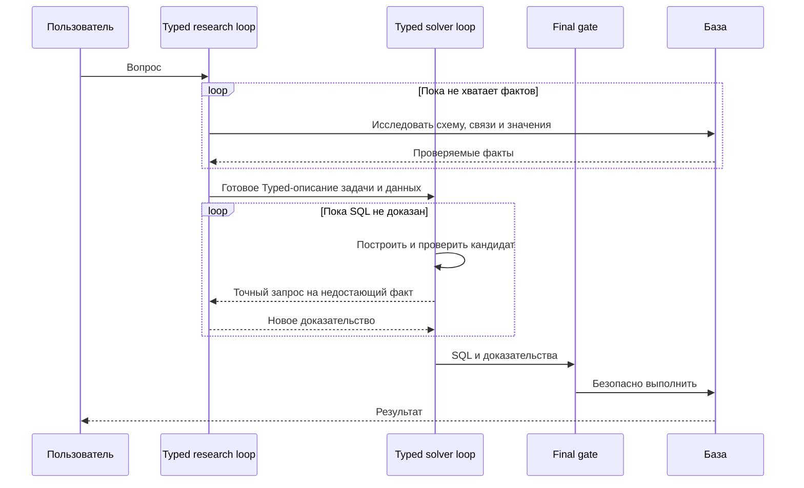

# Chapter 6: Typed Text-to-SQL

Typed Text-to-SQL превращает вопрос на обычном языке в проверенный SQL и ответ из
базы. В проекте остался только этот Text-to-SQL-маршрут.

## Как он работает

```mermaid
sequenceDiagram
    participant U as Пользователь
    participant R as Typed research loop
    participant S as Typed solver loop
    participant G as Final gate
    participant DB as База

    U->>R: Вопрос
    loop Пока не хватает фактов
        R->>DB: Исследовать схему, связи и значения
        DB-->>R: Проверяемые факты
    end
    R->>S: Готовое Typed-описание задачи и данных
    loop Пока SQL не доказан
        S->>S: Построить и проверить кандидат
        S-->>R: Точный запрос на недостающий факт
        R-->>S: Новое доказательство
    end
    S->>G: SQL и доказательства
    G->>DB: Безопасно выполнить
    DB-->>U: Результат
```

Research loop — цикл исследования — не ограничен заранее заданным числом шагов.
Им управляют общий лимит времени и бюджеты. Это позволяет проверять содержимое
таблиц, когда одной схемы недостаточно.

## Точки входа

- React- и Streamlit-интерфейсы вызывают `presets.text_to_sql.generate`.
- Сервис всегда запускает `text_to_sql_pipeline` через enhanced engine
  (движок расширенного workflow).
- Выбора legacy, fallback (запасного пути) или отключения Typed нет.
- General-purpose manager не строит SQL сам: он направляет Text-to-SQL-запрос в
  Typed-сервис.

Точные шаги и входы описаны в
[`workflow_pipelines/text_to_sql_pipeline.yaml`](../../workflow_pipelines/text_to_sql_pipeline.yaml) и
[главе 17](MultiAgent/17_text_to_sql_pipeline.md).

Для бенчмарков обязательны
[правила Text-to-SQL-бенчмарков](../../docs/operations/text2sql-benchmark-protocol.md).
