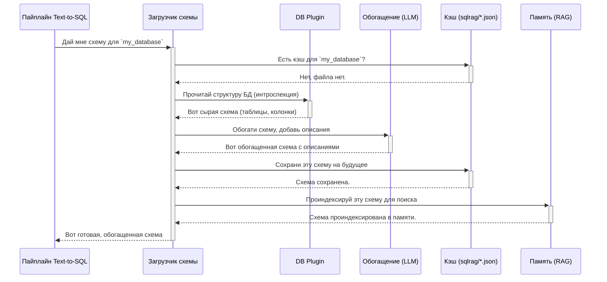

# Chapter 8: Интроспекция и обогащение схемы БД


В [предыдущей главе](07_система_плагинов_для_баз_данных__db_plugins__.md) мы разобрались, как наша система с помощью плагинов-адаптеров может подключаться к самым разным базам данных. Теперь у нашего агента есть "ключи" от хранилища данных. Но что толку от ключей, если он не знает, что лежит на полках?

Представьте, что вас привели на огромный склад и сказали: "Найди деталь для модели T-1000". Без каталога, без маркировки на коробках вы будете блуждать часами. Вам нужен не просто доступ, а **карта склада с пояснениями**.

Именно эту задачу и решает **система интроспекции и обогащения схемы БД**. Это автономный "исследователь данных", который может самостоятельно изучить базу данных и создать для нее ту самую "карту с пояснениями", чтобы агенты могли работать с данными быстро и точно.

## Три кита понимания данных

Процесс "картографирования" базы данных состоит из трех ключевых этапов:

1.  **Интроспекция (Introspection):** Это автоматическое "считывание" структуры базы данных. Система, как инспектор, обходит все "комнаты" (таблицы) и переписывает все "коробки" (колонки) и связи между ними (ключи). В результате мы получаем сырую, техническую схему.
2.  **Обогащение (Enrichment):** Часто технические названия вроде `prod_rev_fy23` или `usr_auth_tkn` ни о чем не говорят. На этом этапе в игру вступает большая языковая модель (LLM). Она анализирует названия, связи и даже примеры данных, чтобы сгенерировать человекопонятные описания. Например, для колонки `prod_rev_fy23` она может создать описание: "Выручка от продукта за 2023 финансовый год".
3.  **Кэширование и Индексация (Caching & Indexing):** Процессы интроспекции и особенно обогащения могут быть долгими и дорогими. Чтобы не повторять их каждый раз, система сохраняет готовую, обогащенную "карту" в специальный JSON-файл в папке `sqlrag/`. При последующих запусках система будет использовать этот кэш. Более того, эта карта загружается в [систему памяти RAG](04_система_памяти_rag__ragmemory__.md), что позволяет агентам выполнять по ней семантический поиск.

## Как это работает?

Весь этот сложный процесс запускается автоматически, когда агент, работающий с [Пайплайном Text-to-SQL](06_пайплайн_text_to_sql_.md), впервые обращается к незнакомой базе данных.



Как только этот одноразовый процесс завершен, при всех последующих запросах к той же базе данных система мгновенно загрузит готовую схему из кэша.

## Что происходит "под капотом"?

Давайте заглянем в код и посмотрим на трех главных действующих лиц этого процесса: `SchemaLoader`, `SchemaEnricher` и `SchemaMemoryManager`.

### Шаг 1: Загрузка схемы (`SchemaLoader`)

Все начинается в файле `custom_tools/text_to_sql/schema_loader.py`. Класс `SchemaLoader` — это диспетчер, который решает, откуда брать схему.

Его главный метод `get_database_schema` работает по простому алгоритму: сначала ищет кэш, и только если его нет — запускает "исследование".

```python
// custom_tools/text_to_sql/schema_loader.py -> SchemaLoader

def get_database_schema(self, ...):
    # 1. Пытаемся загрузить схему из кэш-файла
    dsn = os.getenv("DB_DSN")
    sqlrag_schema = self._load_sqlrag_schema(dsn)
    
    if sqlrag_schema:
        # Если кэш есть - используем его
        logger.info(f"✅ Схема загружена из файла-кэша...")
        return sqlrag_schema

    # 2. Если кэша нет, "читаем" схему напрямую из БД
    logger.info("Кэш не найден, запускаем интроспекцию БД...")
    return self._introspect_via_plugin(dsn)
```
Функция `_introspect_via_plugin` использует [DB плагины](07_система_плагинов_для_баз_данных__db_plugins__.md) для выполнения сырой интроспекции.

### Шаг 2: Обогащение схемы (`SchemaEnricher`)

Если `SchemaLoader` получил "сырую" схему без описаний, он передает ее "художнику-оформителю" — `SchemaEnricher` из файла `custom_tools/text_to_sql/schema_enricher.py`.

Этот класс находит все таблицы и колонки без описаний и отправляет их в LLM для генерации этих описаний.

```python
// custom_tools/text_to_sql/schema_enricher.py -> SchemaEnricher

def enrich_descriptions_with_llm(self, schema_obj):
    # 1. Находим все элементы, у которых нет описаний
    tables_to_process = self._find_undescribed_items(schema_obj)
    
    if not tables_to_process:
        return # Все уже описано, работа не нужна
        
    # 2. Для каждой таблицы...
    for table_name in tables_to_process:
        # ... получаем примеры реальных данных для лучшего контекста
        sample_data = self.get_table_sample_data(table_name)
        
        # ... формируем умный промпт с контекстом и примерами
        prompt = build_column_description_prompt_with_context(...)
        
        # ... просим LLM сгенерировать описания
        response = call_openai_api(prompt, ...)
        
        # ... здесь парсинг ответа и обновление объекта схемы ...
```
Ключевой момент здесь — это `get_table_sample_data`. LLM дает гораздо более точные описания, если видит не только названия `id, created_at, user_name`, но и реальные данные: `1, '2023-10-26', 'John Doe'`.

После обогащения `SchemaLoader` сохраняет результат в JSON-файл в папке `sqlrag/` для будущих поколений.

### Шаг 3: Индексация в памяти (`SchemaMemoryManager`)

Финальный и очень важный этап — загрузка обогащенной схемы в "оперативную память" системы, чтобы агенты могли по ней быстро искать. Этим занимается `SchemaMemoryManager` из `custom_tools/text_to_sql/schema_memory.py`.

```python
// custom_tools/text_to_sql/schema_memory.py -> SchemaMemoryManager

def index_schema_in_memory(self, session_id, db_schema, ...):
    # Для каждой таблицы в нашей схеме...
    for table_fqn, table_schema in db_schema.items():
        
        # 1. Создаем из схемы одно большое текстовое описание
        table_description_for_search = self.create_table_description(...)
        # Пример: "Таблица public.users. Описание: Данные о пользователях.
        # Важные колонки: user_id, name, email."
        
        metadata = { "description": table_description_for_search, ... }
        
        # 2. Сохраняем это описание в RAG-память
        save_memory(
            session_id=session_id,
            agent_name="Schema-RAG-Agent",
            data=metadata
        )
```
После этого агент, получив задачу "покажи почту всех пользователей", может выполнить семантический поиск по своей [RAG-памяти](04_система_памяти_rag__ragmemory__.md). Память ему подскажет, что слова "почта" и "пользователи" очень близки по смыслу к описанию таблицы `public.users`, и тем самым направит пайплайн Text-to-SQL по верному пути.

В том же файле находится и логика поиска. Функция `find_semantic_relevant_tables` берет сущности из запроса пользователя ("почта", "пользователи") и ищет наиболее похожие описания таблиц в памяти.

```python
// custom_tools/text_to_sql/schema_memory.py -> SchemaMemoryManager

def find_semantic_relevant_tables(self, entities: List[str]) -> List[str]:
    # ... подготовка запроса ...
    search_query = " ".join(entities)

    # Выполняем семантический поиск по памяти RAG
    semantic_search_results = memory_manager._search_semantic_with_scores(
        ...
        search_query,
        where={"cache_kind": "schema_table"} # Ищем только по схемам
    )
    
    # ... фильтруем результаты по релевантности и возвращаем имена таблиц ...
    return relevant_tables
```

## Заключение

В этой главе мы увидели, как система `MultiAgent` превращает "незнакомую территорию" базы данных в подробную, аннотированную и удобную для поиска карту. Мы узнали, что:

-   Процесс состоит из **интроспекции**, **обогащения** с помощью LLM и **кэширования**.
-   **`SchemaLoader`** выступает в роли диспетчера, решая, загрузить схему из кэша или запустить полное исследование.
-   **`SchemaEnricher`** использует LLM, чтобы добавить человекопонятные описания к техническим названиям, значительно повышая точность агентов.
-   **`SchemaMemoryManager`** индексирует готовую схему в [памяти RAG](04_система_памяти_rag__ragmemory__.md), делая ее доступной для быстрого семантического поиска.

Это был заключительный фрагмент мозаики. Теперь у вас есть полное представление обо всех ключевых механизмах системы `MultiAgent` — от высокоуровневой координации в `DynamicAgentSystem` до глубокой, автономной работы с данными. Вооружившись этими знаниями, вы готовы не только использовать, но и расширять возможности этого мощного инструмента.

---

