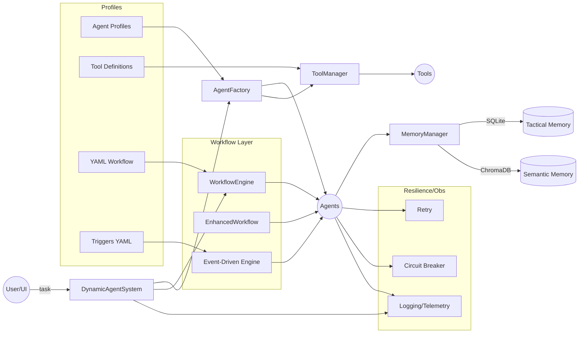

# Глава 1: Обзор архитектуры и принципы

Эта система — модульная платформа для многоагентных решений. Основная идея: отделить декларативные описания (YAML-профили, workflow) от исполняющей логики (Python-компоненты), чтобы быстро собирать команды агентов под задачу.

## Ключевые компоненты
- DynamicAgentSystem: дирижёр, который анализирует задачу, подбирает роли и координирует выполнение через manager-агента.
- Agent Profiles (YAML): «должностные инструкции» агентов — роль, инструменты, модель, политика памяти, промпт.
- AgentFactory: сборочный цех, превращающий профиль в готового агента (инструменты, память, инструкции).
- Tool System: каталог инструментов и менеджер инструментов с телеметрией.
- Memory (RAG): внешняя память на SQLite (тактическая) + ChromaDB (семантическая), единый MemoryManager.
- Workflow Engine: структурированные процессы по YAML-планам; Enhanced/AI-контроль качества; Event-driven запуск по триггерам.
- Resilience: политики повторов, Circuit Breaker, наблюдаемость и логирование.
- UI/API: Streamlit-обвязка и AgentManager для запуска сценариев без блокировки интерфейса.

## Потоки работы
- Динамический: «неизвестный путь» → DynamicAgentSystem формирует команду на лету, менеджер-агент делегирует задачи.
- Структурный (Workflow): «известный путь» → WorkflowDefinition описывает шаги/зависимости; WorkflowEngine исполняет; Enhanced добавляет планирование/оценку.
- Событийный: запуск по событиям/времени/условиям → Event-Driven Workflow Engine с триггерами и Context Enrichment.

## Память и контекст
- Тактическая (SQLite): пошаговые факты, трассировка.
- Семантическая (ChromaDB): поиск релевантного опыта.
- MemoryPolicy: `scope_read`, `search_enabled`, `last_k_steps`, `strategic_write` и др.
- MemoryManager: единая точка записи/чтения и разрешения конфликтов.

## Инструменты и наблюдаемость
- YAML-описания инструментов + загрузчик; вызовы через ToolManager.
- Телеметрия (`@with_telemetry`), централизованное логирование и observability.

## Устойчивость
- Retry Engine с адаптивной стратегией.
- Circuit Breaker для деградации при сбоях.
- Обёртки модели с повторными попытками.

## Технологический стек
- YAML для профилей/воркфлоу/триггеров; Python для логики; Streamlit для UI; asyncio/многопроцессность для отзывчивости.

## Высокоуровневая схема

Эта архитектура позволяет быстро расширять систему (новые профили/инструменты/воркфлоу), сохраняя предсказуемость, наблюдаемость и устойчивость при работе множества специализированных агентов.
