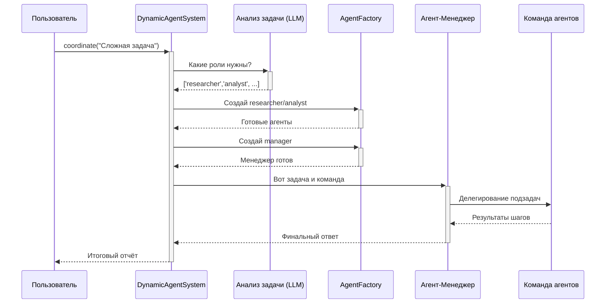

# Глава 2: Динамическая система агентов (DynamicAgentSystem)

Когда задача слишком велика для одного исполнителя, нужен оркестр. **DynamicAgentSystem** — это дирижер, менеджер проекта и мозговой центр, который берёт вашу высокоуровневую задачу и сам:
- анализирует, какие роли требуются (LLM-анализ);
- собирает команду через Фабрику Агентов;
- назначает менеджера-агента для координации;
- собирает финальный отчёт.

## Зачем это нужно
Один агент быстро упирается в ограничения: смешение ролей, ограниченный контекст, отсутствие плана. Командная работа специализирует роли (researcher, analyst, writer и т.д.) и даёт предсказуемый прогресс.

## Как это выглядит на практике
```python
# main.py (упрощённый фрагмент)
import asyncio
from agent_system import DynamicAgentSystem

async def main():
    system = DynamicAgentSystem()
    task = "Проанализировать рынок электромобилей в 2024 году"
    report = await system.coordinate(task, show=True)
    print(report)

asyncio.run(main())
```

- system.coordinate(...) — точка входа; внутри: анализ задачи → подбор ролей → сборка команды → запуск менеджера → финальный отчёт.

## Последовательность (высокоуровнево)


## Ключевые шаги под капотом
### 1) Анализ задачи
```python
# agent_system.py -> coordinate()
agent_types, pipeline_type = await self.analyze_task(initial_task)
```
LLM получает задачу + список доступных профилей и возвращает подходящие роли (например, researcher, analyst, manager).

### 2) Сборка команды
```python
for agent_type in agent_types:
    if agent_type != 'manager':
        agent = self.factory.create_agent(agent_type, session_id, initial_task)
        self.agent_pool[agent.name] = {'agent': agent}
```
Фабрика по YAML-профилю собирает агента: модель, инструменты, политику памяти.

### 3) Назначение и запуск менеджера
```python
manager = self.factory.create_agent('manager', session_id, ...)
answer = manager.run(f"ЗАДАЧА ДЛЯ КООРДИНАЦИИ: {initial_task}")
```
Менеджер-агент декомпозирует, делегирует и синтезирует результат.

### 4) Формирование отчёта
```python
report = [
    "=== ИТОГОВЫЙ ОТЧЕТ ===\n",
    f"🔍 Исходная задача: {initial_task}",
    "\n  ℹ️ Ответ менеджера:",
    f"Подробный отчет:\n{answer}",
]
return "\n".join(report)
```

## Итоги
- DynamicAgentSystem — единая точка входа для сложных задач.
- Динамически подбирает роли и собирает команду.
- Координирует выполнение через manager-агента.
- Возвращает собранный, читаемый итоговый отчёт.
