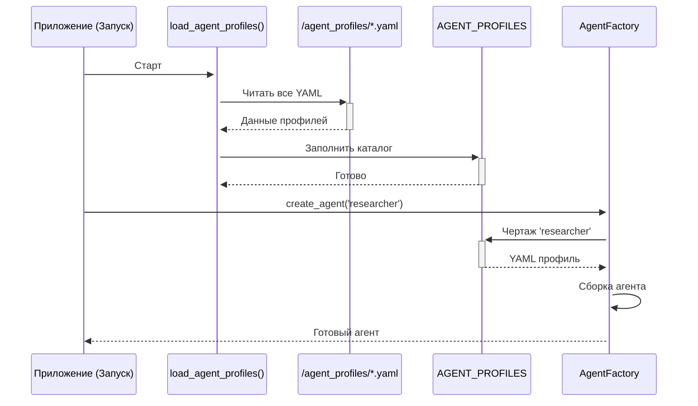

# Глава 3: Профили агентов (Agent Profiles)

Профиль агента — это его "должностная инструкция" в YAML. Он задаёт роль, инструменты, модель, политику памяти и системные инструкции. Благодаря профилям система гибкая: добавление нового агента — это просто новый YAML-файл без правок кода.

## Зачем нужны профили
- Декларативность: описываем поведение, а не прошиваем его в код.
- Прозрачность: любой видит, чем агент занимается, какие у него инструменты и правила.
- Расширяемость: добавили `critic.yaml` — и система знает нового специалиста.

## Анатомия профиля (пример)
```yaml
# agent_profiles/researcher.yaml (упрощённый пример)

enable: true                # можно временно отключить профиль
model: model_search         # преднастроенная конфигурация LLM
type: code                  # code | tool_calling

# доступные инструменты
tools:
  - web_search
  - webpage_content

description: 'Эксперт по поиску и извлечению информации из интернета.'

# правила работы с памятью
memory_policy:
  scope_read: session       # видимость памяти: agent | session | global
  search_enabled: true      # разрешён семантический поиск
  last_k_steps: 5           # ограничение контекста шагов

# системные инструкции (суть роли)
prompt_templates: |-
  # Роль
  Ты — профессиональный исследователь. Твоя задача — находить актуальную
  и релевантную информацию по запросу.

  # Правила
  1. Всегда используй `web_search` для первичного поиска.
  2. Для чтения содержимого — `webpage_content`.
  3. Давай краткую сводку и ссылки на источники.
```

Полезные поля:
- `enable`: быстрый выключатель профиля.
- `model`: выбор пресета модели (например, `model_hard`, `model_lite`, `model_code`).
- `type`: базовый шасси агента (`code` для сложных задач, `tool_calling` — вызовы инструментов).
- `tools`: «навыки», передаваемые агенту.
- `description`: краткое резюме для выбора ролей в команде.
- `memory_policy`: как агент читает/пишет память (см. главу RAG-памяти).
- `prompt_templates`: ядро поведения агента.

## Строгие контракты формата (пример из Text-to-SQL)
```yaml
# agent_profiles/schema_rag_agent.yaml

enable: true
model: model_code
type: code

tools: ['schema_linking', 'get_distinct_values', 'schema_info']

description: 'Эксперт по связыванию схемы БД. Возвращает JSON.'

custom_report_template: "{{final_answer}}"

prompt_templates: |-
  # ⚠️ Обязательный формат вывода — ТОЛЬКО валидный JSON без префиксов ⚠️
  {
    "linked_entities": {
      "metrics": [{"name": "выручка", "table": "sales", "column": "amount"}]
    }
  }
```
Это важно для конвейеров: следующий шаг ожидает строго определённый формат.

## Загрузка профилей при старте
```python
# agent_command.py (упрощённо)

def load_agent_profiles():
    profiles = {}
    for filename in os.listdir('agent_profiles'):
        if filename.endswith('.yaml'):
            agent_name = filename[:-5]
            data = yaml.safe_load(open(os.path.join('agent_profiles', filename), 'r', encoding='utf-8'))
            if data.get('enable', True):
                profiles[agent_name] = data
    return profiles

AGENT_PROFILES = load_agent_profiles()
```
`AgentFactory` просто берёт профиль из `AGENT_PROFILES` по имени.

## Добавим нового агента за минуту (critic)
```yaml
# agent_profiles/critic.yaml

enable: true
type: code
model: model_lite

description: "Оценивает текст и предлагает улучшения."

tools: []

memory_policy:
  provide_run_summary: false
  search_enabled: false

prompt_templates: |
  Ты — строгий, но справедливый критик.
  Выдели сильные стороны, укажи слабые и предложи конкретные улучшения.
```
Перезапуск — и агент доступен всей системе.

## Визуализация процесса


## Вывод
- Профили — фундамент гибкости системы.
- Чётко описывают роль, инструменты, модели и правила памяти.
- Лёгкое расширение без правок кода.
