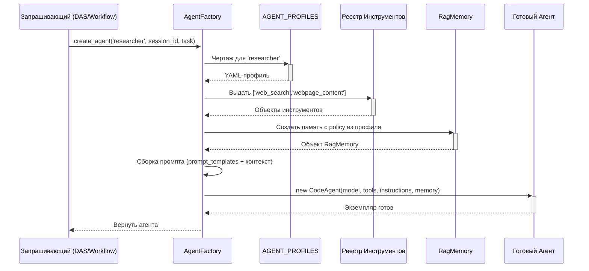
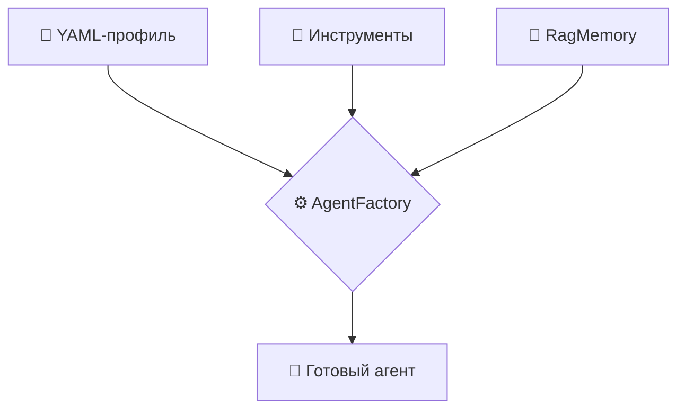

# Глава 4: Фабрика агентов (AgentFactory)

`AgentFactory` — это сборочный цех и отдел кадров одновременно. По запросу (например, из DynamicAgentSystem) она берёт YAML-профиль, выдаёт инструменты, подключает память, прошивает инструкции и возвращает готового агента.

## Задачи фабрики
1. Найти профиль в `AGENT_PROFILES`.
2. Создать/выдать инструменты по именам из профиля.
3. Подключить RAG-память с политикой из профиля.
4. Сформировать композитный промпт.
5. Создать экземпляр агента нужного типа (`code`/`tool_calling`).

## Поток создания


## Ключевые шаги в коде (упрощённо)
### 1) Профиль
```python
if profile_type not in AGENT_PROFILES:
    raise ValueError(f"Неизвестный профиль: {profile_type}")
profile = AGENT_PROFILES[profile_type]
```

### 2) Инструменты
```python
profile_tools = profile.get('tools', [])
tools = [self.tool_mapping.get(name) for name in profile_tools]
tools = [t for t in tools if t is not None]
```
`self.tool_mapping` заполняется при инициализации через `load_tools()` (см. главу про инструменты).

### 3) Память
```python
rag_memory = create_rag_memory(
    session_id=session_id,
    agent_name=profile_type,
    profile_config=profile,
)
```
Используются поля `memory_policy` (например, `scope_read`, `search_enabled`, `strategic_write`).

### 4) Инструкции
```python
def _build_composite_prompt(profile, session_id):
    base = profile.get('prompt_templates', '')
    extra = f"\nsession_id: {session_id}\n"
    return base + extra

instructions = _build_composite_prompt(profile, session_id)
```

### 5) Экземпляр агента
```python
agent_type = profile.get('type', 'code')
if agent_type == 'tool_calling':
    agent = ToolCallingAgent(model=profile.get('model'), tools=tools, instructions=instructions)
else:
    agent = CodeAgent(model=profile.get('model'), tools=tools, instructions=instructions)

agent.memory = rag_memory
return agent
```

## Визуализация конвейера


## Примечания
- Инструменты могут поступать как из YAML-определений, так и из внешних источников (MCP), но фабрика работает с единым реестром.
- Профили отделяют конфигурацию от реализации. Любое изменение (модель, инструменты, политика памяти) — правкой YAML.
- Для потоков, требующих строгого формата вывода (например, Text-to-SQL), профиль может задавать жёсткий contract в `prompt_templates`.

## Вывод
`AgentFactory` централизует сборку агентов и делает систему расширяемой: новый профиль — новый специалист без правок кода.
