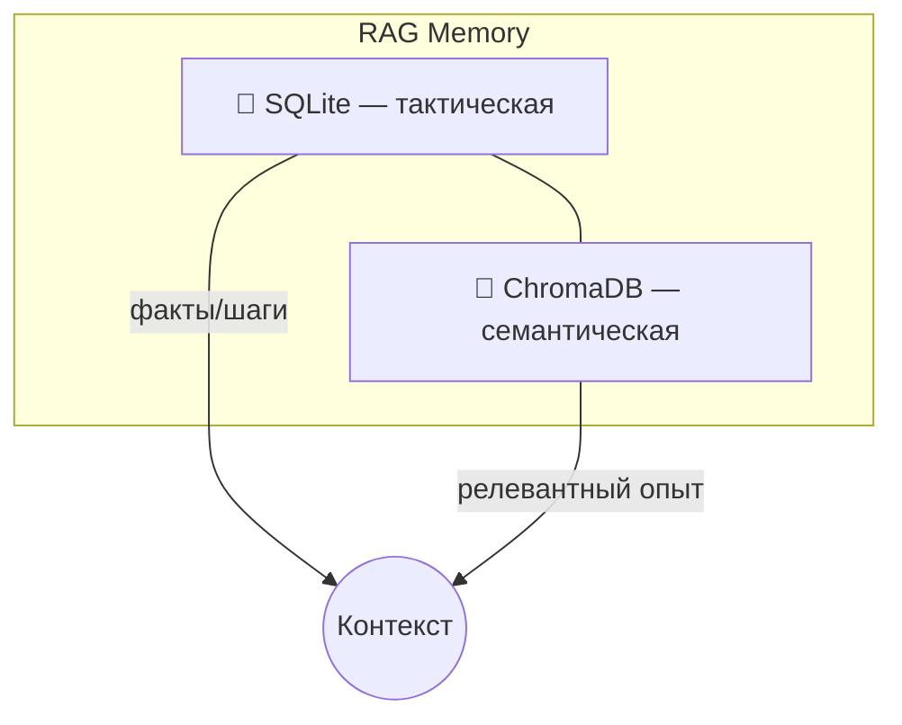
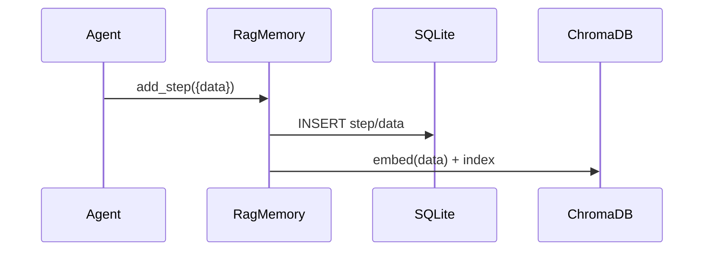
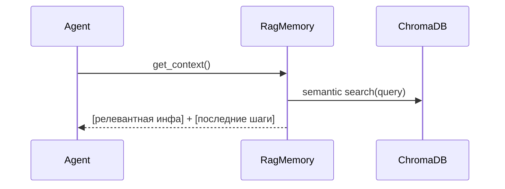

# Глава 8: Система памяти (RAG)

Внешний «мозг» агентов сочетает две части:
- Тактическая память (SQLite) — пошаговые факты и трассировка.
- Семантическая память (ChromaDB) — поиск по смыслу с эмбеддингами.

## Зачем
- Учиться на опыте, не начинать каждую задачу с нуля.
- Делиться знаниями по правилам доступа.
- Экономить вызовы LLM и время.

## Архитектура


## Политика памяти (memory_policy в профилях)
```yaml
memory_policy:
  scope_read: session    # none | agent | session
  search_enabled: true
  last_k_steps: 5
  allow_add_step: true
  strategic_write: true  # для общих целей/контекста
```
- `scope_read`: область чтения (личная/сессия).
- `search_enabled`: включить семантический поиск.
- `last_k_steps`: сколько последних шагов включать.
- `allow_add_step`: разрешить запись шагов.
- `strategic_write`: писать стратегический контекст.

## Жизненный цикл данных
### Сохранение опыта


Пример инструмента:
```python
# memory/tools.py (упрощённо)
@tool
def save_memory(session_id: str, agent_name: str, data: Dict) -> int:
    # write to SQLite, add embedding to Chroma
    ...
```

### Получение контекста


Пример API:
```python
# memory/rag_memory.py (упрощённо)
class RagMemory:
    def get_context(self, max_tokens: int | None = None) -> str:
        parts = []
        if self.policy.search_enabled:
            parts.append(self._semantic_search(self.current_run_context))
        parts.append(self._last_steps(self.policy.last_k_steps))
        return "\n\n".join(p for p in parts if p)
```

## Инициализация БД
```python
# memory/database.py (фрагмент)
class DatabaseHandler:
    def _init_chroma(self, embedding_model: str):
        self.embedding_model = SentenceTransformer(embedding_model)
        self.chroma_client = chromadb.PersistentClient(path=self.chroma_path)
        self.tactical_collection = self.chroma_client.get_or_create_collection("tactical_memory")
```

## Вывод
- Связка SQLite+ChromaDB превращает память в обучаемую библиотеку.
- Политики управляются из YAML-профилей, без правок кода.
- `save_memory`/`get_context` закрывают большую часть сценариев.
