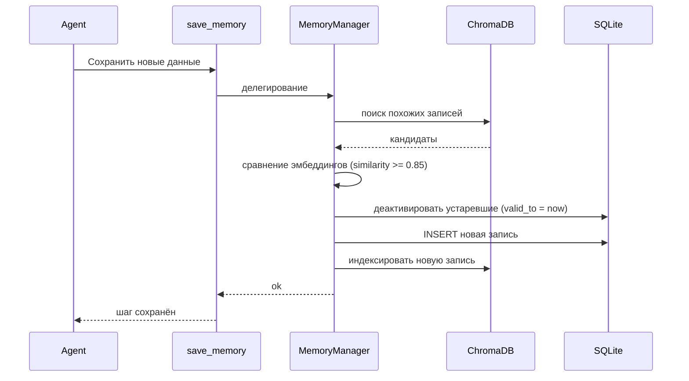

# Глава 9: Менеджер памяти (MemoryManager)

Централизованный «библиотекарь» памяти: единая точка входа к SQLite/ChromaDB, потокобезопасность и интеллектуальное разрешение конфликтов.

## Зачем
- Исключить гонки и дубли при одновременной записи.
- Скрыть детали БД от агентов и инструментов.
- Поддерживать актуальность знаний (деактивация устаревших записей).

## Роль и доступ
```python
# memory/manager.py (упрощённо)
from .manager import get_memory_manager
memory_manager = get_memory_manager()  # синглтон
```
Все операции с памятью (через инструменты `save_memory`, `get_memory`) проксируются в менеджер.

## Поток сохранения с разрешением конфликтов


## Ключевые фрагменты логики
### Поиск и выявление конфликтов
```python
def _resolve_conflicts(self, session_id: str, agent_name: str, new_data: Dict) -> list:
    new_text = self._extract_text_content(new_data)
    if not new_text:
        return []
    where = {"$and": [{"session_id": {"$eq": session_id}}, {"agent_name": {"$eq": agent_name}}]}
    candidates = self._search_semantic(self.db_handler.tactical_collection, new_text, n_results=10, where=where)
    new_emb = self._create_embedding(new_text)
    conflicts = []
    for tid in candidates:
        existing_emb = ...
        if cosine_sim(new_emb, existing_emb) >= 0.85:
            conflicts.append(tid)
    return conflicts
```

### Деактивация устаревших записей
```python
def _deactivate_conflicting_records(self, conflicts: list):
    if not conflicts:
        return
    now = datetime.now().isoformat()
    for (session_id, agent_name, step) in conflicts:
        cursor.execute("UPDATE agent_memory SET valid_to = ? WHERE session_id=? AND agent_name=? AND step=?", (now, session_id, agent_name, step))
    conn.commit()
```

## Потокобезопасность и единый доступ
- Синглтон + последовательная обработка запросов устраняют гонки за ресурсы.
- Инкапсуляция подключения/курсов в `DatabaseHandler`.

## API для UI
- `MemoryRAGManager` (streamlit API): статус, поиск, перестроение индекса.

## Вывод
`MemoryManager` превращает множество личных дневников (`RagMemory`) в единый, целостный и актуальный корпоративный архив, сохраняя консистентность и удобство работы для агентов.
