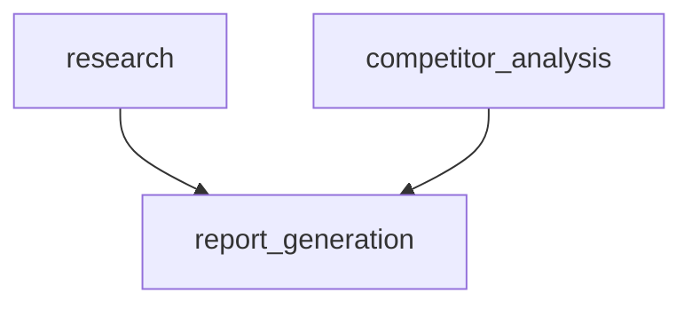

# Глава 10: Определение Workflow (WorkflowDefinition)

WorkflowDefinition — декларативный «чертёж» процесса в YAML: шаги, зависимости, условия и политики. Движок читает его и исполняет без хаоса.

## Зачем
- Прозрачный план: человек и машина понимают один и тот же YAML.
- Надёжность: строгие зависимости исключают гонки и пропуски.
- Гибкость: правки без изменений кода.

## Пример YAML
```yaml
# workflow_pipelines/ev_market_report.yaml
name: "EV Market Report"
description: "Сбор, анализ, отчёт по рынку электромобилей"
inputs:
  topic: "рынок электромобилей"
  competitors: ["Tesla", "BYD", "Volkswagen"]
steps:
  - id: research
    agent_type: researcher
    task: "Собери материалы по теме '{topic}' за последний год"

  - id: competitor_analysis
    agent_type: analyst
    task: "Проанализируй позиции: {competitors}"
    depends_on: [research]

  - id: report_generation
    agent_type: writer
    task: "Собери итоговый отчёт из research и competitor_analysis"
    depends_on: [research, competitor_analysis]
```

Граф зависимостей:


## Расширения
- condition: условное выполнение шага.
- retry_policy: max_retries, стратегия бэкоффа.
- parallel_execution: независимые шаги — параллельно.
- step_type: tool — прямой вызов инструмента без агента.

## От YAML к объектам Python
```python
# workflow/models.py (идея)
@dataclass
class WorkflowStep:
    id: str
    task: str
    agent_type: str | None = None
    depends_on: list[str] = field(default_factory=list)
    retry_policy: RetryPolicy | None = None

@dataclass
class WorkflowDefinition:
    name: str
    description: str
    steps: list[WorkflowStep]

    @classmethod
    def from_yaml(cls, yaml_path: str) -> "WorkflowDefinition":
        data = yaml.safe_load(open(yaml_path, 'r', encoding='utf-8'))
        return cls.from_dict(data)
```

## Вывод
WorkflowDefinition переносит сложность из кода в декларативную структуру: проще править, легче контролировать и повторно использовать.
