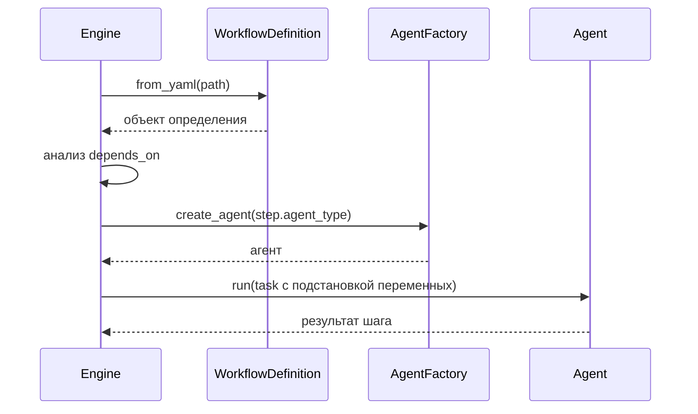

# Глава 11: Движок рабочих процессов (WorkflowEngine)

WorkflowEngine — «прораб», который читает чертёж `WorkflowDefinition` и исполняет шаги в правильном порядке, создавая нужных агентов и передавая данные между шагами.

## Как используется
```python
engine = WorkflowEngine()
result = await engine.execute_workflow_from_yaml(
    yaml_path="workflow_pipelines/ev_market_report.yaml",
    topic="рынок беспилотных авто",
    competitors=["Waymo","Cruise","Zoox"],
)
```

## Поток выполнения


## Ключевые методы (упрощённо)
Загрузка и запуск:
```python
async def execute_workflow_from_yaml(self, yaml_path: str, **vars):
    workflow_def = WorkflowDefinition.from_yaml(yaml_path)
    context = WorkflowContext(variables=vars)
    return await self.execute_workflow(workflow_def, context)
```

Последовательное исполнение и зависимости:
```python
async def _execute_steps_sequential(self, workflow_def, context):
    step_results = {}
    for step in workflow_def.steps:
        if not self._check_step_dependencies(step, step_results):
            continue
        step_results[step.id] = await self._execute_workflow_step(step, context, workflow_def)
        if step_results[step.id].status != StepStatus.COMPLETED:
            raise WorkflowExecutionError(f"Шаг {step.id} провален")
    return step_results
```

Исполнение шага с повторами:
```python
async def _execute_workflow_step(self, step, context, workflow_def):
    async def step_executor(exec_ctx):
        formatted = self._format_task_with_variables(step.task, context, step.id)
        return await self._execute_agent_step(step, context, formatted)
    return await self.retry_engine.execute_with_retry(step_id=step.id, step_func=step_executor)
```

Вызов агента:
```python
async def _execute_agent_step(self, step, context, task: str):
    agent = self.factory.create_agent(step.agent_type, context.session_id, task)
    return agent.run(task, stream=False)
```

## Шаги-инструменты
```yaml
- id: generate_visual
  step_type: tool
  tool_name: generate_image_tool
  tool_params:
    prompt: "Иллюстрация: {topic}"
    session_id: "{session_id}"
```
Такие шаги выполняются быстрее и дешевле — без LLM-агента.

## Надёжность: RetryPolicy
```yaml
- id: research
  agent_type: researcher
  task: "Ищи: {topic}"
  retry_policy:
    max_retries: 3
    backoff_strategy: exponential
```
Движок прозрачно повторит шаг при временных сбоях.

## Вывод
WorkflowEngine выполняет YAML-планы предсказуемо и устойчиво: соблюдает зависимости, подставляет переменные, поддерживает шаги-инструменты и автоматические повторы.
