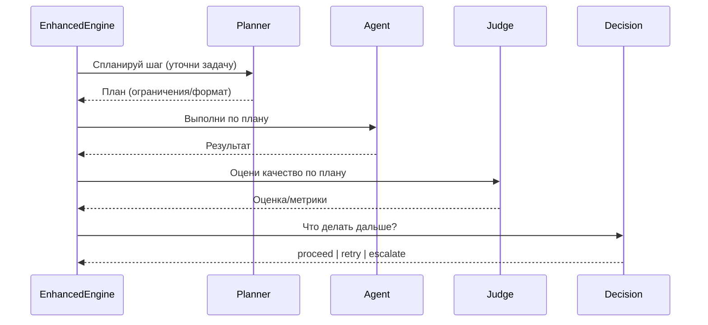

# Глава 12: Расширенный движок процессов (EnhancedWorkflowEngine)

EnhancedWorkflowEngine добавляет поверх WorkflowEngine интеллектуальный цикл качества и устойчивости: планирование шага, оценку результата, решение о продолжении/повторе и защиту от сбоев.

## Зачем
- Качество: проверять, «насколько хорошо» выполнен шаг, а не только «выполнен ли».
- Самокоррекция: при низком качестве — доуточнить задачу и повторить.
- Устойчивость: выключать «падающих» исполнителей и экономить ресурсы.

## Цикл выполнения


## Ключевые точки (упрощённо)
Одна попытка шага:
```python
async def _execute_single_step_attempt(self, step, wf_ctx):
    plan = await self.planner.plan_step(step, wf_ctx)
    result = await self.circuit_breaker_manager.call_agent_safely(
        agent_name=step.agent_type,
        agent_func=self._execute_step_with_policy,
    )
    verdict = await self.judge.validate_result(result, plan)
    decision = await self.decision_engine.make_decision(verdict)
    if decision.action != "proceed":
        raise Exception(f"{decision.action}: {decision.reason}")
    return result
```

Адаптивные повторы:
```python
return await self.retry_engine.execute_with_retry(
    step_id=step.id,
    step_func=self._execute_single_step_attempt,
    on_retry_modify_context_func=self._apply_decision_modifications,
)
```
Повторная попытка может уточнить задачу/контекст по рекомендации `decision_engine`.

Circuit Breaker:
```python
result = await self.circuit_breaker_manager.call_agent_safely(
    agent_name=step.agent_type,
    agent_func=...
)
```
При серии сбоев «выключатель» размыкается и предотвращает дальнейшие вызовы проблемного агента.

## Конфигурация
```yaml
# workflow/config/enhanced_global.yaml
features:
  pre_step_planner: { enabled: true }
  post_step_judge:  { enabled: true }
  circuit_breaker:  { enabled: true }

# workflow/config/policies/default.yaml
quality_gates:
  default:
    min_quality_score: 0.7
    hard_fail_threshold: 0.3
```

## Вывод
EnhancedWorkflowEngine добавляет «разум» к конвейеру: планирует, проверяет, принимает решения и защищает процесс, обеспечивая предсказуемое качество и устойчивость.
