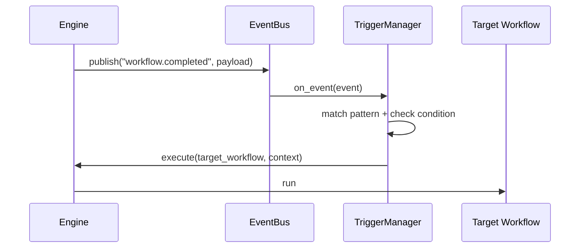

# Глава 13: Событийно-управляемый Workflow Engine

Расширение WorkflowEngine для реактивной автоматизации: рабочие процессы запускаются по событиям, по времени или по условиям.

## Понятия
- Событие (Event): факт, что-то произошло (например, `workflow.completed`, `new_file.uploaded`).
- Триггер (Trigger): правило «если событие/время/условие, то запустить workflow X».

## Типы триггеров
- EVENT_BASED: реагирует на событие по шаблону (`workflow.completed`).
- TIME_BASED: cron/расписание (ежедневные задачи).
- CONDITION_BASED: периодическая проверка условия.

## Пример конфигурации
```yaml
# config/triggers.yaml
triggers:
  report_on_sql_success:
    enabled: true
    trigger_type: event_based
    event_pattern: "workflow.completed"
    condition: "event.payload.workflow_name == 'Text-to-SQL Pipeline'"
    target_workflow: "generate_and_email_report"
```

## Архитектура


## Обогащение контекста (ContextEnrichment)
Перед запуском целевого workflow триггер может подтянуть данные из памяти (RAG) и внедрить их как входные переменные.

```yaml
triggers:
  report_on_sql_success:
    target_workflow: "generate_and_email_report"
    context_enrichment:
      memory_queries:
        - query: "Последний сгенерированный SQL-запрос"
          inject_as: "last_sql_query"
          session_id: "{event.payload.client_id}"
```

## Вывод
Event-Driven Workflow Engine добавляет реактивность: процессы соединяются через события и легко настраиваются YAML-правилами, а контекст можно обогащать из памяти для более точной автоматизации.
