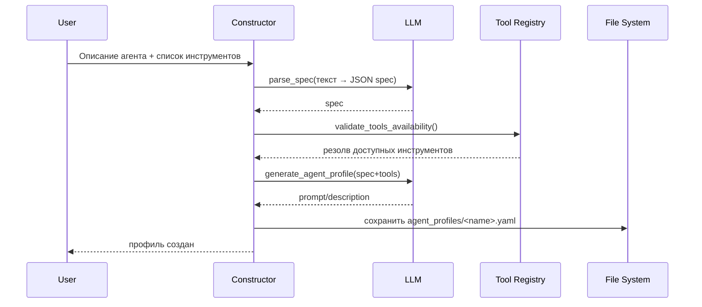

# Глава 14: Конструктор агентов (Agent Constructor)

Мета-агент, который по текстовому описанию генерирует готовый YAML‑профиль нового агента: быстро, последовательно и без ошибок в синтаксисе.

## Что делает
- Анализирует описание роли и задач (LLM).
- Проверяет доступность запрошенных инструментов.
- Планирует минимальные зависимости/порядок.
- Генерирует YAML‑профиль с description/prompt/tools/model.

## Конвейер из 4 шагов


## Ключевые операции (упрощённо)
Анализ спецификации:
```python
def parse_spec(description: str) -> dict:
    raw = call_openai_api(prompt=description, system_prompt="Верни ТОЛЬКО JSON по схеме ...")
    return normalize(raw)
```
Проверка инструментов:
```python
def validate_tools_availability(tools: list[str]) -> dict:
    custom = set(_load_custom_tool_names())
    mcp = set(_load_mcp_tool_names())
    resolved, missing = [], []
    for t in tools:
        if t in custom: resolved.append({"type": "custom", "name": t})
        elif t in mcp: resolved.append({"type": "mcp", "name": t})
        else: missing.append(t)
    return {"tools_resolved": resolved, "unavailable_tools": missing}
```
Генерация профиля:
```python
def generate_agent_profile(spec: dict, tools: list[dict]) -> str:
    prompt = call_openai_api(...)
    desc = call_openai_api(...)
    profile = {
        "type": "tool_calling",
        "description": desc,
        "model": "model_code",
        "tools": [t["name"] for t in tools],
        "prompt_templates": prompt,
        "enable": True,
    }
    path = f"agent_profiles/{spec['agent_name']}.yaml"
    save_yaml(path, profile)
    return path
```

## Пример результата
```yaml
# agent_profiles/financial_analyst.yaml
type: tool_calling
model: model_code
description: "Агент-аналитик по CSV. Находит строки с максимальной прибылью."
tools:
  - file_read
  - csv_parser
prompt_templates: |
  Ты — точный и педантичный финансовый аналитик...
  1) Прочитай файл через file_read
  2) Разбери csv_parser
  3) Найди максимальную прибыль
  4) Верни структурированный вывод
enable: true
```

## Примечание
Сам Конструктор — тоже агент с собственным профилем и наборами инструментов, вызываемый как обычный агент внутри системы.
