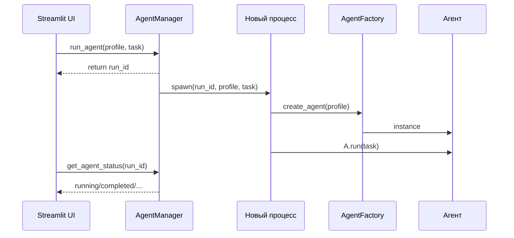

# Глава 20: AgentManager для UI

Диспетчерский слой для запуска агентов из веб‑интерфейса: изоляция процессов, стабильные API и отслеживание статусов по run_id.

## Задача
- Упростить UI: запускать агентов без знания внутренностей.
- Обеспечить устойчивость: отдельные процессы, отмена, статусы.

## Основные операции
- list_agents() — список профилей для выбора в UI.
- run_agent(profile, task) → run_id — немедленный ответ, агент выполняется фоном.
- get_agent_status(run_id) — статус: queued/running/completed/failed/cancelled.
- get_agent_result(run_id) — итоговый отчет после завершения.

## Как работает
- Каждый запуск — отдельный процесс с собственным агентом.
- Глобальный реестр `_GLOBAL_ACTIVE_RUNS` хранит статусы по run_id.
- Возврат `run_id` мгновенный; UI опрашивает статус отдельно.



## Пример
```python
mgr = AgentManager()
run_id = mgr.run_agent("researcher", "Проанализируй рынок")
status = mgr.get_agent_status(run_id)
if status.status == "completed":
    result = mgr.get_agent_result(run_id)
```

## Итого
AgentManager обеспечивает чистый контракт для UI, изолируя тяжелую работу агентов и предоставляя управляемые статусы по run_id.
