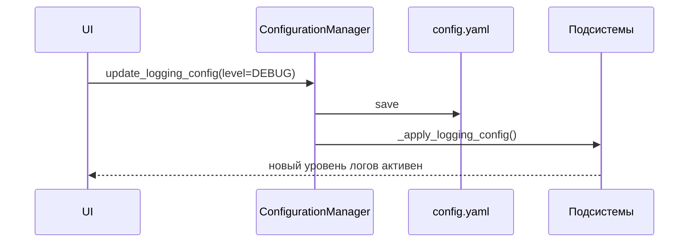

# Глава 21: Менеджер Конфигурации (ConfigurationManager)

Централизованная конфигурация в YAML с горячим применением без перезапуска приложения.

## Зачем
- Единая точка для LLM, логов, телеметрии, безопасности.
- Правки из UI, моментальное применение.

## Где хранится
- `config/streamlit_config.yaml` — человекочитаемый источник истины.
- Отражается в строго типизированных dataclass (например, `SystemConfiguration`).

## Поток изменений


## Интерфейс
```python
cm = get_configuration_manager()
config = cm.get_config()
config.logging.level = "DEBUG"
cm.update_logging_config(config.logging)
```

## Применение «на лету»
- `_apply_logging_config()` — меняет уровень root logger.
- Аналогично для телеметрии/LLM и др. через `_apply_*`.

## Итого
ConfigurationManager отделяет код от настроек, ускоряет отладку и повышает управляемость системы.
