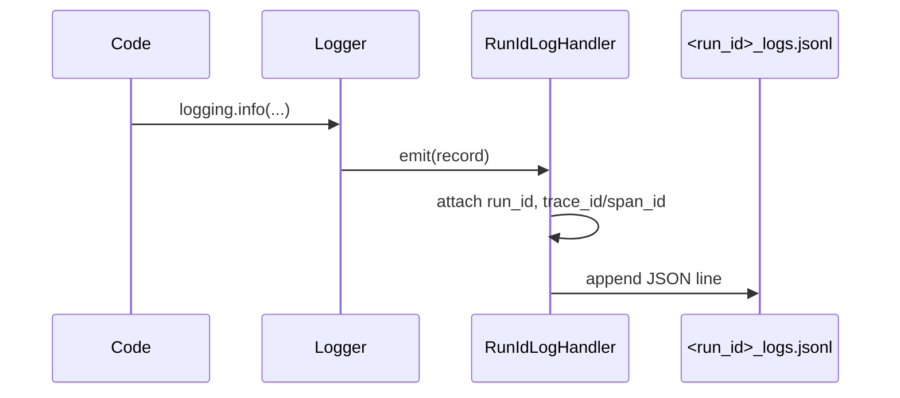

# Глава 22: Логирование (UnifiedLoggingManager)

Единая система логов, коррелируемых по run_id даже в отдельных процессах.

## Проблема
Многопроцессность перемешивает сообщения; сложно отследить один запуск.

## Решение
- `run_id_context(run_id)` — контекст, добавляющий run_id ко всем логам.
- Кастомный `RunIdLogHandler` — пишет JSONL в файлы вида `<run_id>_logs.jsonl`.
- Интеграция с OpenTelemetry: trace_id, span_id в каждой записи.

## Использование
```python
with run_id_context(run_id):
    logger.info("Старт агента")
    # ...
    logger.info("Финиш")
```

## Поток


## Итого
Структурированные логи на запуск, готовые к анализу и связке с трассами телеметрии.
