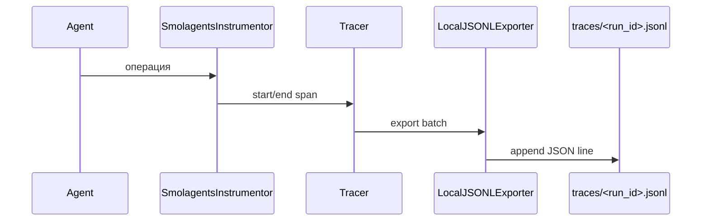

# Глава 23: Телеметрия (SmolagentsTelemetryManager)

Глубокие трассы выполнения агентов и инструментов на базе OpenTelemetry с локальным хранением.

## Зачем
- Видеть длительность и иерархию операций (спаны).
- Находить «узкие места» и коррелировать с логами по run_id.

## Как устроено
- TracerProvider + SimpleSpanProcessor.
- LocalJSONLExporter — пишет спаны в `<run_id>.jsonl`.
- RunIdPropagatingSpanProcessor — прокидывает run_id в каждый спан.
- SmolagentsInstrumentor — автотрейсинг вызовов smol-agents.

## Поток

## Просмотр в UI
- Страница Logs/Traces: список трасс, детальная диаграмма (Гант‑подобная) по выбранному run_id.

## Итого
Телеметрия делает выполнение прозрачным: где тратится время, какая операция «тормозит», и как она связана с логами.
