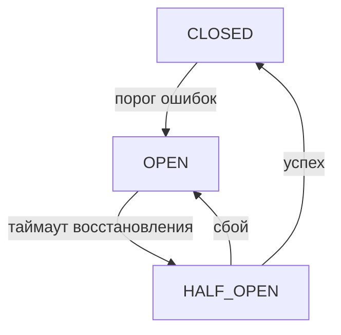

# Глава 24: Система устойчивости (Resilience)

Набор «систем безопасности» для предсказуемого и экономного выполнения: бюджеты, предохранители и детектор циклов.

## Компоненты
- BudgetManager: лимиты по времени/стоимости/токенам/API‑вызовам.
- Circuit Breaker: быстрый отсекатель при лавине ошибок.
- Loop Detector: защита от зацикливания шагов.

## BudgetManager
```python
# Пример: задать лимиты и учитывать расход
budget_manager.create_workflow_budget(
  workflow_id="run-abc123",
  limits={"cost": 10.0, "time": 1800}
)
if budget_manager.check_budget("run-abc123", "cost", 0.05):
    # выполнить LLM‑вызов и списать
    budget_manager.consume_budget("run-abc123", "cost", 0.05)
else:
    raise Exception("Бюджет исчерпан")
```

## Circuit Breaker


```python
# Безопасный вызов агента через предохранитель
result = await cb_manager.call_agent_safely(
  agent_name="researcher",
  agent_func=agent.run,
  task="Найди..."
)
```

## Loop Detector
```python
loop_detected = loop_detector.record_step_execution(
  workflow_id="run-abc123",
  step_id="research_step",
  execution_data={"task": "...", "output": "..."}
)
if loop_detected:
    raise RuntimeError("Обнаружено зацикливание")
```

## Итого
Resilience‑слой предотвращает перерасход и простои: ограничивает бюджеты, гасит лавины ошибок и останавливает бесконечные повторы. 
