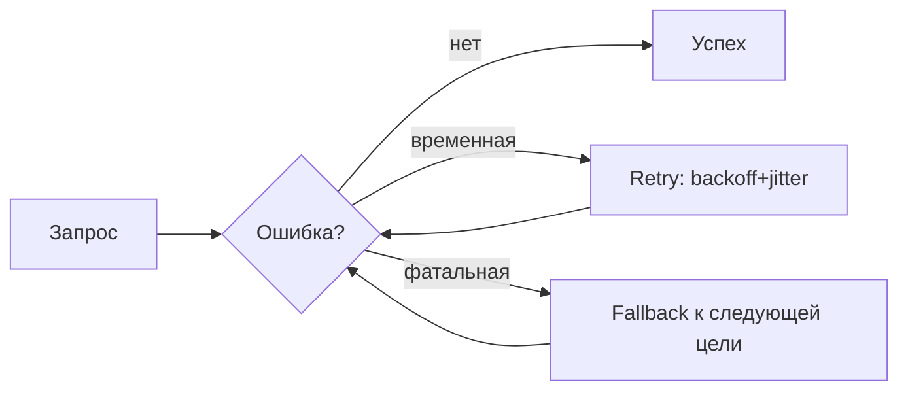

# Глава 25: Механизм повторных попыток (Retry Engine)

Настойчивость при временных сбоях и адаптивные фоллбеки на альтернативные модели/источники.

## Идея
- Повторные попытки с экспоненциальной задержкой и jitter.
- Классификация ошибок: временные (retry) vs фатальные (fallback/abort).
- Список fallback‑целей (моделей) по приоритету.

## Классификация ошибок (пример)
- retry: 5xx, timeouts, connection reset.
- fallback: 404 model not found, quota exceeded, постоянный 429.

## Псевдокод
```python
def call_with_retry(send, fallbacks, max_retries):
    models = [primary] + fallbacks
    i = 0
    while i < len(models):
        for attempt in range(max_retries + 1):
            try:
                return send(models[i])
            except Exception as e:
                if should_fallback(e):
                    break  # перейти к следующей цели
                sleep(backoff(attempt) + jitter())
        i += 1
    raise RuntimeError("All targets unavailable")
```

## Диаграмма


## Итого
Retry Engine сглаживает сбои и автоматизирует переключение на альтернативы, повышая надежность без усложнения пользовательского кода.
