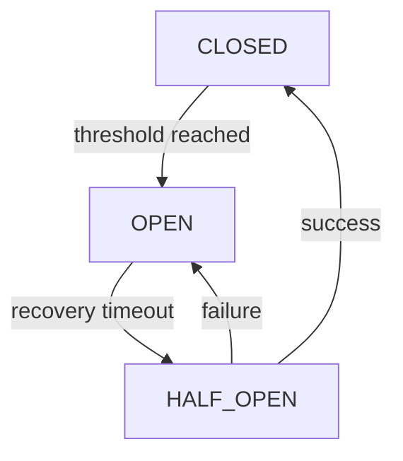

# Глава 26: Circuit Breaker

Предохранитель, предотвращающий лавину неудачных вызовов к сбойному агенту/сервису.

## Состояния
- CLOSED: все вызовы проходят; считаем ошибки.
- OPEN: временная блокировка; новые вызовы отклоняются сразу.
- HALF‑OPEN: пробный вызов после таймаута восстановления.



## Безопасный вызов
```python
result = await cb_manager.call_agent_safely(
  agent_name="researcher",
  agent_func=agent.run,
  task="Найди свежие источники"
)
```

## Параметры
- failure_threshold: сколько подряд ошибок до OPEN.
- recovery_timeout: пауза перед HALF‑OPEN.
- error_classifier: что считать «сбоем» для счетчика.

## Итого
Circuit Breaker защищает систему от повторяющихся сбоев и экономит бюджет, быстро «отсекая» проблемный контур и позволяя ему восстановиться.
