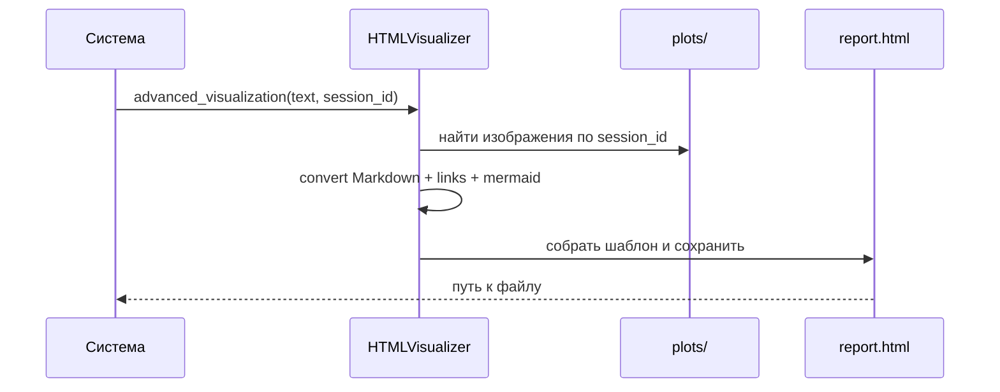

# Глава 27: HTML Visualizer

Преобразует сырой результат агентов (Markdown/ссылки/диаграммы/изображения) в красивый интерактивный HTML‑отчет.

## Что делает
- Конвертирует Markdown → HTML, ссылки → кликабельные.
- Встраивает PNG‑графики по `session_id` (Base64).
- Поддерживает Mermaid‑диаграммы с переключением темы, копированием кода и экспортом.

## Использование
```python
path = html_visualizer.advanced_visualization(result, session_id, show=True)
```

## Конвейер


## Итого
HTML Visualizer отвечает за «последнюю милю»: делает отчеты удобочитаемыми и интерактивными без ручной верстки.
