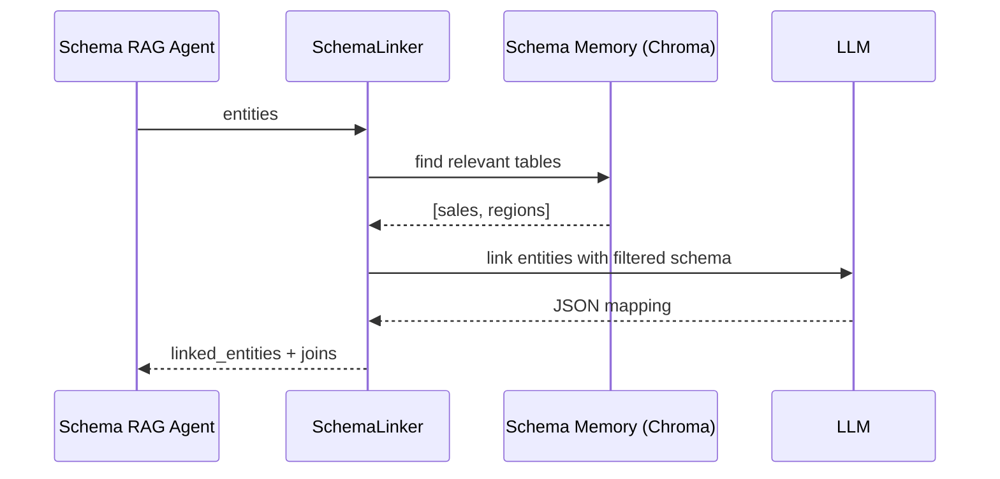

# Глава 29: Schema Linker

Картограф между естественным языком и схемой БД для Text‑to‑SQL.

## Что делает
- Сопоставляет метрики/измерения/фильтры из NLU с таблицами и колонками.
- Строит необходимые JOIN‑связи.

## Гибридный подход
1) Семантический поиск по памяти схемы (RAG) → релевантные таблицы.
2) Сфокусированный промпт к LLM → точное сопоставление сущностей с полями.
3) Валидация + построение JOIN.



## Пример результата
```json
{
  "linked_entities": {
    "metrics": [{"name": "выручка", "table": "sales", "column": "amount"}],
    "dimensions": [{"name": "регионы", "table": "regions", "column": "region_name"}]
  },
  "joins": [{"from_table": "sales", "from_column": "region_id", "to_table": "regions", "to_column": "id"}]
}
```

## Итого
Schema Linker превращает пользовательские сущности в конкретные поля БД, минимизируя контекст для LLM и обеспечивая точность и воспроизводимость.
