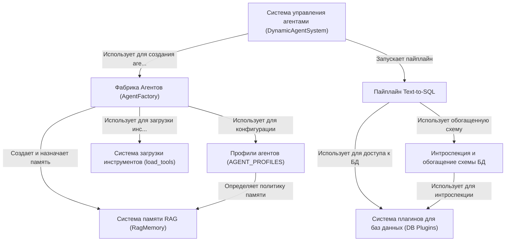

# Tutorial: MultiAgent

Этот проект представляет собой *продвинутую мультиагентную систему*, где **главный дирижер (Система управления агентами)** координирует команду специализированных ИИ-агентов для выполнения сложных задач. Система использует **Фабрику Агентов** для динамического создания специалистов на основе готовых *"должностных инструкций" (Профили агентов)*, оснащая их необходимыми инструментами. Ключевой особенностью является **умная RAG-память**, позволяющая агентам учиться на прошлом опыте. Одной из самых мощных функций является **пайплайн Text-to-SQL**, который преобразует человеческий язык в запросы к базам данных, поддерживая различные СУБД через **систему плагинов** и автоматически **обогащая схемы данных** для лучшего понимания.

## Chapters

1. [Система управления агентами (DynamicAgentSystem)
](01_система_управления_агентами__dynamicagentsystem__.md)
2. [Фабрика Агентов (AgentFactory)
](02_фабрика_агентов__agentfactory__.md)
3. [Профили агентов (AGENT_PROFILES)
](03_профили_агентов__agent_profiles__.md)
4. [Система памяти RAG (RagMemory)
](04_система_памяти_rag__ragmemory__.md)
5. [Система загрузки инструментов (load_tools)
](05_система_загрузки_инструментов__load_tools__.md)
6. [Пайплайн Text-to-SQL
](06_пайплайн_text_to_sql_.md)
7. [Система плагинов для баз данных (DB Plugins)
](07_система_плагинов_для_баз_данных__db_plugins__.md)
8. [Интроспекция и обогащение схемы БД
](08_интроспекция_и_обогащение_схемы_бд_.md)

---
